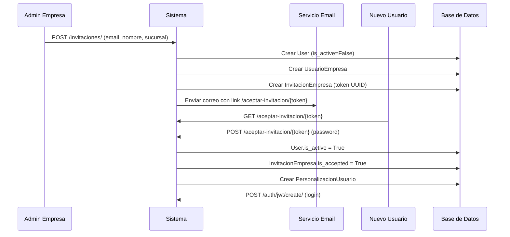
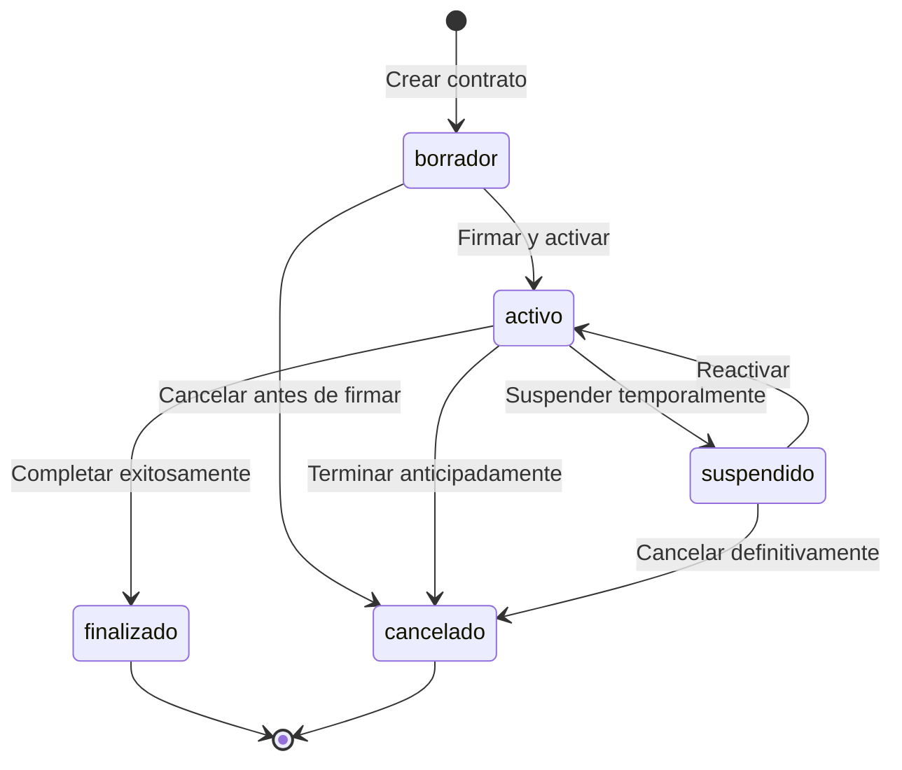
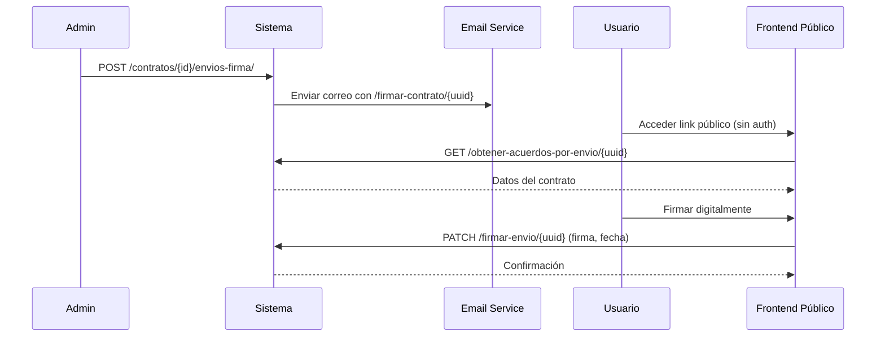
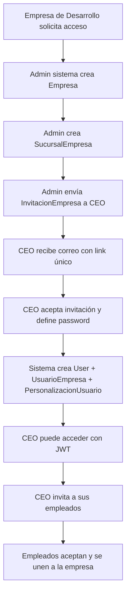
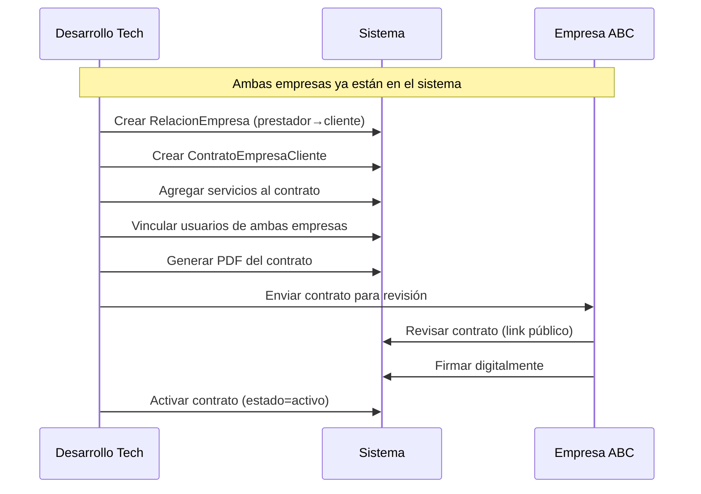
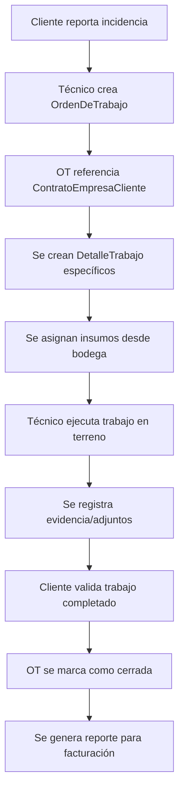

# Módulos de Autenticación y Contratos

## 📋 Índice
1. [Contextualización del Sistema](#contextualización-del-sistema)
2. [Módulo de Autenticación](#módulo-de-autenticación)
3. [Módulo de Contratos](#módulo-de-contratos)
4. [Flujos Completos de Usuario](#flujos-completos-de-usuario)
5. [Casos de Uso Reales](#casos-de-uso-reales)
6. [Preguntas Frecuentes Resueltas](#preguntas-frecuentes-resueltas)

---

## Contextualización del Sistema

### 🎯 Propósito Original vs Visión Futura

**Propósito Inicial:**
El sistema comenzó como una herramienta **interna** para una empresa de servicios tecnológicos que necesitaba:
- Registrar visitas a clientes
- Gestionar inventario para servicios
- Controlar trabajos/proyectos
- Mantener constancia de actividades

**Visión Futura:**
Evolucionar hacia una **plataforma SaaS** donde múltiples empresas pueden:
- Gestionar sus propias operaciones
- Tener clientes y prestar servicios
- Manejar contratos complejos
- Administrar equipos de trabajo

### 🏗️ Arquitectura Multi-Tenant

El sistema está diseñado con una arquitectura **multi-empresa** donde:

```
Sistema ERP
├── Empresa A (Prestadora de servicios)
│   ├── Sucursales
│   ├── Usuarios internos
│   └── Clientes (Empresas B, C, D)
├── Empresa B (Cliente de A, pero también puede ser prestadora)
│   ├── Sucursales
│   ├── Usuarios internos
│   └── Sus propios clientes
└── Empresa C, D, E...
```

**Relaciones dinámicas:**
- Una empresa puede ser **prestadora** para algunos y **cliente** de otros
- Las relaciones se definen mediante `RelacionEmpresa`
- Los contratos formalizan estas relaciones comerciales

---

## Módulo de Autenticación

### 🔐 Arquitectura de Seguridad

#### User Model Personalizado

```python
# cuentas/models.py
class User(AbstractBaseUser, PermissionsMixin, ModeloBase):
    email               = EmailField(unique=True)  # Email como username
    first_name          = CharField(max_length=250)
    second_name         = CharField(blank=True, null=True)
    last_name           = CharField(max_length=250)
    second_last_name    = CharField(blank=True, null=True)
    
    # Control de acceso
    is_active           = BooleanField(default=False)  # ⚠️ Inactivo por defecto
    is_staff            = BooleanField(default=False)
    
    # Información personal
    rut                 = CharField(unique=True, blank=True, null=True)
    celular             = CharField(blank=True, null=True)
    genero              = CharField(choices=GENEROS, default='0')
    fecha_nacimiento    = DateField(null=True, blank=True)
    
    # Ubicación
    direccion           = CharField(blank=True, null=True)
    region              = IntegerField(default=0)
    provincia           = IntegerField(default=0)
    comuna              = IntegerField(default=0)
```

**Características clave:**
- **Email único como identificador** (no username tradicional)
- **Inactivo por defecto** hasta aceptar invitación
- **Datos personales extendidos** (RUT, ubicación, contacto)
- **Herencia de permisos** Django estándar

#### JWT Authentication Stack

```python
# sw_erp/settings.py
REST_FRAMEWORK = {
    'DEFAULT_AUTHENTICATION_CLASSES': [
        'rest_framework_simplejwt.authentication.JWTAuthentication',  # Principal
        'rest_framework.authentication.TokenAuthentication',         # Fallback
    ],
    'DEFAULT_PERMISSION_CLASSES': [
        'rest_framework.permissions.AllowAny',  # ⚠️ Permisivo por defecto
    ],
}

SIMPLE_JWT = {
    'ACCESS_TOKEN_LIFETIME': timedelta(hours=5),    # Token corto
    'REFRESH_TOKEN_LIFETIME': timedelta(hours=10),  # Refresh más largo
    'ROTATE_REFRESH_TOKENS': True,                  # Rotación de seguridad
    'BLACKLIST_AFTER_ROTATION': True,              # Blacklist tokens usados
    'ALGORITHM': 'HS256',
    'AUTH_HEADER_TYPES': ('Bearer',),
}
```

**Endpoints de autenticación:**
```bash
# Djoser + SimpleJWT
POST /auth/jwt/create/          # Login (email + password)
POST /auth/jwt/refresh/         # Refresh token
POST /auth/jwt/verify/          # Verificar token
POST /auth/users/               # Registro (si está habilitado)
```

#### Sistema de Invitaciones

**Flujo completo:**



**Modelo InvitacionEmpresa:**
```python
class InvitacionEmpresa(ModeloBase):
    email = EmailField()
    first_name = CharField()
    last_name = CharField()
    token = UUIDField(default=uuid4, unique=True)           # Token invitación
    activation_token = UUIDField(default=uuid4, unique=True) # Token activación
    sucursal = ForeignKey(SucursalEmpresa)
    
    # Estados
    is_accepted = BooleanField(default=False)
    is_denied = BooleanField(default=False)
    
    # Fechas
    invited_at = DateTimeField(default=timezone.now)
    accepted_at = DateTimeField(blank=True, null=True)
    expiration_date = DateTimeField()  # Auto: invited_at + 7 días
```

**Validaciones importantes:**
- ✅ Email no puede estar registrado previamente
- ✅ Invitación expira en 7 días
- ✅ Se puede reenviar (extiende expiración)
- ✅ Al aceptar, se crea `PersonalizacionUsuario` con sucursal principal

#### Contexto Multi-Empresa

**UsuarioEmpresa (Modelo de Contexto):**
```python
class UsuarioEmpresa(ModeloBase):
    usuario = OneToOneField(User)          # ⚠️ OneToOne: 1 usuario = 1 empresa
    sucursal = ForeignKey(SucursalEmpresa) # Sucursal específica
    empresa = # Derivada de sucursal.empresa
    
    # Información laboral
    fecha_ingreso = DateField()
    fecha_contrato = DateField()
    cargo = CharField()
    estado = CharField(choices=ESTADO_USUARIO_EMPRESA, default="1")
    
    # Permisos
    grupos = ManyToManyField(Group)  # Django Groups por empresa
```

**PersonalizacionUsuario (Preferencias):**
```python
class PersonalizacionUsuario(ModeloBase):
    usuario = OneToOneField(User)
    tema = CharField(choices=OPCIONES_TEMA, default="1")
    font_size = PositiveIntegerField(default=13)
    sucursal_principal = ForeignKey(SucursalEmpresa)  # Contexto por defecto
    dashboard_preferences = JSONField(default=default_dashboard_preferences)
```

**Función helper crítica:**
```python
# cuentas/functions.py
def obtener_usuario_empresa(user):
    return get_object_or_404(UsuarioEmpresa, usuario=user)
```

### 🔍 Limitaciones Actuales del Sistema

#### 1. OneToOne Constraint
```python
# ❌ LIMITACIÓN: Un usuario solo puede pertenecer a UNA empresa
usuario = OneToOneField(User)  # Esto impide multi-empresa por usuario
```

**Impacto:**
- Un técnico no puede trabajar para múltiples empresas
- No hay freelancers o consultores externos
- Migraciones futuras serían complejas

**Solución futura:**
```python
# ✅ MEJORADO: Relación Many-to-Many
class UsuarioEmpresa(ModeloBase):
    usuario = ForeignKey(User)  # Permite múltiples relaciones
    empresa = ForeignKey(Empresa)
    sucursal = ForeignKey(SucursalEmpresa)
    rol_empresa = CharField(...)  # "empleado", "consultor", "cliente"
    fecha_inicio = DateField()
    fecha_fin = DateField(null=True, blank=True)
    activo = BooleanField(default=True)
```

#### 2. Permisos Simplificados
```python
# settings.py
'DEFAULT_PERMISSION_CLASSES': [
    'rest_framework.permissions.AllowAny',  # ⚠️ TODO: Cambiar por IsAuthenticated
],
```

**Problemas:**
- Toda la API es pública por defecto
- No hay control granular por empresa
- Falta middleware de contexto empresarial

#### 3. Sistema de Grupos Básico
```python
# Actual: Grupos Django estándar
grupos = ManyToManyField(Group)

# ✅ Necesario: Roles por empresa
class RolEmpresa(ModeloBase):
    nombre = CharField()  # "admin", "tecnico", "contador"
    empresa = ForeignKey(Empresa)
    permisos = ManyToManyField(Permission)
```

---

## Módulo de Contratos

### 📄 Arquitectura Contractual

#### ContratoEmpresaCliente (Modelo Principal)

```python
class ContratoEmpresaCliente(ModeloBaseHistorico):
    # Relación comercial
    empresa_prestadora = ForeignKey(Empresa, related_name="contratos_como_prestadora")
    empresa_cliente = ForeignKey(Empresa, related_name="contratos_como_cliente")
    
    # Temporalidad
    fecha_inicio = DateField()
    fecha_fin = DateField(blank=True, null=True)  # Puede ser indefinido
    
    # Control de estado
    estado = CharField(choices=ESTADOS_CONTRATO, default='borrador')
    # ['borrador', 'activo', 'suspendido', 'finalizado', 'cancelado']
    
    # Metadatos
    nombre = CharField(max_length=100)
    tipo = CharField(choices=TIPO_CONTRATO, default='servicios')
    # ['servicios', 'licencia', 'soporte', 'proyecto']
    observaciones = TextField(blank=True, null=True)
```

**Estados del contrato:**


#### Polimorfismo en Servicios

**ContratoServicio (Tabla Intermedia con GenericFK):**
```python
class ContratoServicio(ModeloBaseHistorico):
    contrato = ForeignKey(ContratoEmpresaCliente)
    
    # GenericForeignKey para polimorfismo
    content_type = ForeignKey(ContentType, limit_choices_to={
        "model__in": ["servicio", "planservicio"]
    })
    object_id = PositiveIntegerField()
    servicio_generico = GenericForeignKey("content_type", "object_id")
    
    # Términos comerciales
    cantidad = PositiveIntegerField(default=1)
    precio_unitario = DecimalField(max_digits=10, decimal_places=2)
```

**Servicios y Planes:**
```python
class Servicio(ModeloBase):
    nombre = CharField(max_length=255)
    descripcion = TextField(blank=True, null=True)
    categoria = CharField(choices=CATEGORIAS_SERVICIO, default='soporte')
    # ['soporte', 'desarrollo', 'infraestructura', 'consultoria']
    caracteristicas = ManyToManyField(CaracteristicaServicio)

class PlanServicio(ModeloBase):
    nombre = CharField(max_length=255)
    descripcion = TextField(blank=True, null=True)
    servicios = ManyToManyField(Servicio, related_name="planes")
```

**Uso del polimorfismo:**
```python
# Un contrato puede incluir servicios individuales Y planes
contrato.servicios_genericos.add(servicio_desarrollo)    # Servicio individual
contrato.servicios_genericos.add(plan_completo_it)       # Plan integral
```

#### Gestión de Licencias con Windowing

**ContratoLicencia (Modelo Complejo):**
```python
class ContratoLicencia(ModeloBaseHistorico):
    contrato = ForeignKey(ContratoEmpresaCliente)
    licencia = ForeignKey(Licencia)
    
    # Modalidad de licenciamiento
    tipo_modalidad = CharField(choices=TIPO_MODALIDAD_LICENCIA, default='otros')
    # ['p1y-a': pago anual/reducción anual
    #  'p1y-m': pago anual/reducción mensual  
    #  'p1m-m': pago mensual/reducción mensual
    #  'otros': sin restricciones de windowing]
    
    # Términos económicos
    cantidad = PositiveIntegerField(default=1)
    precio_unitario = DecimalField(max_digits=10, decimal_places=2)
    tipo_moneda = CharField(choices=TIPO_MONEDA_LICENCIA, default="USD")
    
    # Temporalidad específica (puede diferir del contrato padre)
    fecha_inicio = DateField(blank=True, null=True)
    fecha_fin = DateField(blank=True, null=True)
    
    # Usuarios vinculados
    usuarios = ManyToManyField(UsuarioEmpresa, through="UsuarioVinculadoLicencia")
```

**Sistema de Windowing para Licencias:**

El *windowing* controla **cuándo** se pueden **reducir** licencias según modalidad de pago:

```python
# Propiedades del modelo
@property
def puede_reducir(self):
    """¿Se puede reducir la cantidad de licencias HOY?"""
    dias = self.dias_desde_inicio_periodo
    return dias is not None and dias <= 7

@property
def inicio_periodo_actual(self):
    """Inicio de la ventana actual de reducción"""
    fecha_base = self.fecha_inicio or self.contrato.fecha_inicio
    if self.tipo_modalidad in ('p1y-a', 'p1y-m'):
        # Bloques anuales
        rd = relativedelta(date.today(), fecha_base)
        bloques = rd.years
        return fecha_base + relativedelta(years=bloques)
    elif self.tipo_modalidad == 'p1m-m':
        # Bloques de 30 días
        total_dias = (date.today() - fecha_base).days
        bloques = total_dias // 30
        return fecha_base + relativedelta(days=bloques * 30)
    return None

def clean(self):
    """Validación de reducción de licencias"""
    if (self.pk and  # Solo al actualizar
        self.cantidad < original_cantidad and  # Reduciendo cantidad
        not self.puede_reducir):  # Fuera de ventana
        
        raise ValidationError(
            f"No puedes reducir licencias fuera de los primeros 7 días del período."
        )
```

**Ejemplos de windowing:**

```python
# Modalidad p1y-a (Pago anual, reducción anual)
# Fecha inicio: 2024-01-15
# Ventanas de reducción: 2024-01-15 al 2024-01-22, 2025-01-15 al 2025-01-22, etc.

# Modalidad p1m-m (Pago mensual, reducción mensual) 
# Fecha inicio: 2024-01-15
# Ventanas: 2024-01-15 al 2024-01-22, 2024-02-14 al 2024-02-21, etc. (cada 30 días)
```

#### Usuarios y Firmas

**UsuarioVinculadoContrato:**
```python
class UsuarioVinculadoContrato(ModeloBase):
    usuario = ForeignKey(UsuarioEmpresa)
    contrato = ForeignKey(ContratoEmpresaCliente)
    tipo_usuario = CharField(choices=TIPOS_USUARIO_CONTRATO, default='gerencia')
    # ['gerencia', 'tecnico', 'financiero', 'legal']
```

**Sistema de Firmas Digitales:**
```python
class EnvioContratoFirmaUsuario(ModeloBase):
    usuario = ForeignKey(UsuarioVinculadoContrato)
    uuid = UUIDField(unique=True, default=uuid4)  # Link público
    
    # Estado de envío
    enviado = BooleanField(default=False)
    fecha_envio = DateTimeField(blank=True, null=True)
    
    # Firma digital
    firmado = BooleanField(default=False)
    firma = TextField(blank=True, null=True)  # SVG/Base64
    fecha_firma = DateTimeField(blank=True, null=True)
```

**Flujo de firma:**


#### Integración con Ordenes de Trabajo

**Conexión con el módulo OT:**
```python
# En ordentrabajo/models.py
class DetalleTrabajo(ModeloBaseHistorico):
    # ...
    trabajo = GenericForeignKey('content_type', 'trabajo_id')
    # Puede apuntar a: Cotizacion, VisitaSoporte, Compra

# Posible extensión futura:
class ContratoOT(ModeloBase):
    """Vincular OTs a contratos para facturación"""
    contrato = ForeignKey(ContratoEmpresaCliente)
    orden_trabajo = ForeignKey(OrdenDeTrabajo)
    incluido_en_contrato = BooleanField(default=True)
    costo_adicional = DecimalField(default=0)
```

### 📊 Generación de PDFs

**Funcionalidad de ReportLab:**
```python
# contratos/funciones.py
def generar_contrato_en_memoria(nombre_archivo_pdf, datos_cliente, datos_contrato):
    """Genera PDF usando ReportLab con datos dinámicos"""
    buffer = BytesIO()
    doc = SimpleDocTemplate(buffer, pagesize=LETTER)
    
    elementos = [
        Paragraph("CONTRATO DE SERVICIOS TECNOLÓGICOS", estilo_titulo),
        # Tabla con datos del cliente
        # Cláusulas y condiciones
        # Lista de servicios/tareas
        # Sección de firmas
    ]
    
    doc.build(elementos)
    return buffer.getvalue()
```

**Endpoint:**
```python
# GET /api/contratos/{id}/pdf/
@action(detail=True, methods=['get'], url_path='pdf')
def pdf(self, request, pk=None):
    datos_cliente = {...}  # Del contrato.empresa_cliente
    datos_contrato = {...} # Del contrato y sus relaciones
    
    pdf_buffer = generar_contrato_en_memoria(datos_cliente, datos_contrato)
    response = HttpResponse(pdf_buffer, content_type='application/pdf')
    return response
```

---

## Flujos Completos de Usuario

### 🚀 Flujo 1: Onboarding de Nueva Empresa

**Escenario:** Una empresa de desarrollo quiere usar el sistema



**Código de ejemplo:**
```python
# 1. Admin del sistema crea empresa
empresa = Empresa.objects.create(
    nombre="Desarrollo Tech SpA",
    rut_empresa="76.123.456-7",
    direccion_principal="Las Condes 123",
    email="contacto@desarrollotech.cl"
)

# 2. Crear sucursal principal
sucursal = SucursalEmpresa.objects.create(
    nombre="Casa Matriz",
    empresa=empresa,
    direccion="Las Condes 123",
    email="contacto@desarrollotech.cl"
)

# 3. Invitar al CEO
POST /api/invitaciones/
{
  "email": "ceo@desarrollotech.cl",
  "first_name": "Juan",
  "last_name": "Pérez", 
  "sucursal": sucursal.id
}
```

### 🤝 Flujo 2: Establecer Relación Cliente-Proveedor

**Escenario:** Desarrollo Tech quiere prestar servicios a Empresa ABC



**Código de ejemplo:**
```python
# 1. Establecer relación comercial
relacion = RelacionEmpresa.objects.create(
    prestador_servicios=desarrollo_tech,
    cliente=empresa_abc,
    tipo_relacion="prestador-cliente"
)

# 2. Crear contrato
contrato = ContratoEmpresaCliente.objects.create(
    empresa_prestadora=desarrollo_tech,
    empresa_cliente=empresa_abc,
    fecha_inicio=date.today(),
    nombre="Contrato Desarrollo Web 2024",
    tipo="servicios",
    estado="borrador"
)

# 3. Agregar servicios
servicio_web = Servicio.objects.get(nombre="Desarrollo Web")
ContratoServicio.objects.create(
    contrato=contrato,
    content_type=ContentType.objects.get_for_model(Servicio),
    object_id=servicio_web.id,
    cantidad=1,
    precio_unitario=1500000
)

# 4. Vincular usuarios
UsuarioVinculadoContrato.objects.create(
    usuario=ceo_desarrollo_tech,
    contrato=contrato,
    tipo_usuario="gerencia"
)
```

### 🔧 Flujo 3: Ejecutar Servicio Bajo Contrato

**Escenario:** Desarrollo Tech debe realizar mantenimiento según contrato



**Código de ejemplo:**
```python
# 1. Crear OT vinculada a contrato
ot = OrdenDeTrabajo.objects.create(
    empresa=desarrollo_tech,
    cliente=empresa_abc,
    descripcion="Mantenimiento servidor según contrato 2024",
    contrato_relacionado=contrato,  # Futura extensión
    responsable_empresa=tecnico_senior
)

# 2. Crear detalle específico
detalle = DetalleTrabajo.objects.create(
    orden=ot,
    nombre="Actualización sistema operativo",
    descripcion="Aplicar parches de seguridad y updates",
    tecnico_asignado=tecnico_junior
)

# 3. El resto sigue el flujo normal de OT...
```

### 💰 Flujo 4: Gestión de Licencias con Windowing

**Escenario:** Empresa ABC tiene licencias Office 365 con modalidad anual

```python
# Crear licencia en contrato
licencia_office = ContratoLicencia.objects.create(
    contrato=contrato,
    licencia=Licencia.objects.get(nombre="Office 365 Business"),
    tipo_modalidad="p1y-a",  # Pago anual, reducción anual
    cantidad=50,
    precio_unitario=12.99,
    tipo_moneda="USD",
    fecha_inicio=date(2024, 1, 15)
)

# Verificar si se puede reducir HOY
if licencia_office.puede_reducir:
    print(f"Ventana abierta hasta: {licencia_office.fin_periodo_actual}")
    # Reducir licencias
    licencia_office.cantidad = 45
    licencia_office.save()  # Validación pasará
else:
    print(f"Próxima ventana: {licencia_office.inicio_periodo_actual + relativedelta(years=1)}")
```

---

## Casos de Uso Reales

### 💼 Caso 1: Empresa de Soporte IT

**Contexto:** "TechSupport SPA" presta servicios de mantención a PyMEs

**Setup inicial:**
```python
# 1. Crear empresa proveedora
tech_support = Empresa.objects.create(
    nombre="TechSupport SPA",
    rut_empresa="76.555.666-7",
    direccion_principal="Providencia 1234"
)

# 2. Crear sucursales
casa_matriz = SucursalEmpresa.objects.create(
    nombre="Casa Matriz",
    empresa=tech_support,
    direccion="Providencia 1234"
)

sucursal_norte = SucursalEmpresa.objects.create(
    nombre="Sucursal Norte",
    empresa=tech_support,
    direccion="Antofagasta 567"
)

# 3. Invitar personal
# CEO
POST /api/invitaciones/ { "email": "ceo@techsupport.cl", "sucursal": casa_matriz.id }

# Técnicos
POST /api/invitaciones/ { "email": "tecnico1@techsupport.cl", "sucursal": casa_matriz.id }
POST /api/invitaciones/ { "email": "tecnico2@techsupport.cl", "sucursal": sucursal_norte.id }
```

**Servicios ofrecidos:**
```python
# Crear catálogo de servicios
servicios = [
    Servicio.objects.create(
        nombre="Mantención Preventiva",
        categoria="soporte",
        descripcion="Revisión mensual de equipos"
    ),
    Servicio.objects.create(
        nombre="Soporte Remoto",
        categoria="soporte", 
        descripcion="Asistencia técnica remota 24/7"
    ),
    Servicio.objects.create(
        nombre="Instalación Redes",
        categoria="infraestructura",
        descripcion="Diseño e instalación de redes corporativas"
    )
]

# Crear plan integral
plan_pyme = PlanServicio.objects.create(
    nombre="Plan PyME Integral",
    descripcion="Mantención + Soporte + Instalaciones"
)
plan_pyme.servicios.set(servicios)
```

**Contratos con clientes:**
```python
# Cliente: Clínica Dental
clinica = Empresa.objects.create(nombre="Clínica Dental Norte", rut_empresa="77.888.999-0")

contrato_clinica = ContratoEmpresaCliente.objects.create(
    empresa_prestadora=tech_support,
    empresa_cliente=clinica,
    nombre="Contrato Soporte IT 2024",
    tipo="servicios",
    fecha_inicio=date(2024, 1, 1),
    fecha_fin=date(2024, 12, 31),
    estado="activo"
)

# Agregar plan al contrato
ContratoServicio.objects.create(
    contrato=contrato_clinica,
    content_type=ContentType.objects.get_for_model(PlanServicio),
    object_id=plan_pyme.id,
    cantidad=1,
    precio_unitario=500000  # $500.000 mensual
)
```

### 🏢 Caso 2: Consultoría con Licencias Software

**Contexto:** "Innova Consulting" vende licencias Microsoft + servicios

**Gestión de licencias:**
```python
# Licencias en catálogo
licencias = [
    Licencia.objects.create(
        nombre="Office 365 Business Premium",
        proveedor="Microsoft"
    ),
    Licencia.objects.create(
        nombre="Windows Server 2022",
        proveedor="Microsoft"
    ),
    Licencia.objects.create(
        nombre="SQL Server Standard",
        proveedor="Microsoft"
    )
]

# Contrato con modalidades diferenciadas
contrato_empresa = ContratoEmpresaCliente.objects.create(
    empresa_prestadora=innova_consulting,
    empresa_cliente=empresa_mediana,
    nombre="Contrato Licenciamiento 2024",
    tipo="licencia",
    estado="activo"
)

# Office 365: Pago anual, reducción mensual (más flexible)
office_licencia = ContratoLicencia.objects.create(
    contrato=contrato_empresa,
    licencia=licencias[0],
    tipo_modalidad="p1y-m",  # Pagaron anual, pueden reducir mensualmente
    cantidad=100,
    precio_unitario=12.99,
    tipo_moneda="USD",
    fecha_inicio=date(2024, 3, 1)
)

# SQL Server: Pago anual, reducción anual (restrictivo)
sql_licencia = ContratoLicencia.objects.create(
    contrato=contrato_empresa,
    licencia=licencias[2],
    tipo_modalidad="p1y-a",  # Solo pueden reducir en aniversario
    cantidad=5,
    precio_unitario=1899.99,
    tipo_moneda="USD",
    fecha_inicio=date(2024, 3, 1)
)
```

**Asignación de usuarios:**
```python
# Asignar licencias a usuarios específicos
for usuario in empresa_mediana.usuarios_activos[:50]:
    UsuarioVinculadoLicencia.objects.create(
        usuario=usuario,
        licencia=office_licencia
    )

# Verificar disponibilidad
disponibles = office_licencia.licencias_disponibles  # 100 - 50 = 50
```

### 🔄 Caso 3: Multi-Tenant Real

**Contexto:** Múltiples empresas usando el sistema simultáneamente

```python
# Empresa A es proveedora de servicios
empresa_a = Empresa.objects.create(nombre="Servicios Tech A")

# Empresa B es cliente de A, pero también presta servicios a C
empresa_b = Empresa.objects.create(nombre="Distribuidora B")
empresa_c = Empresa.objects.create(nombre="Retail C") 

# Relaciones cruzadas
RelacionEmpresa.objects.create(
    prestador_servicios=empresa_a,
    cliente=empresa_b,
    tipo_relacion="prestador-cliente"
)

RelacionEmpresa.objects.create(
    prestador_servicios=empresa_b,  # B es proveedora para C
    cliente=empresa_c,
    tipo_relacion="prestador-cliente"
)

# Usuario de B puede tener dos contextos:
usuario_b = UsuarioEmpresa.objects.get(usuario__email="manager@distribuidora.cl")

# Contexto 1: Como cliente de A
contrato_a_b = ContratoEmpresaCliente.objects.create(
    empresa_prestadora=empresa_a,
    empresa_cliente=empresa_b,
    nombre="Soporte IT para Distribuidora"
)

# Contexto 2: Como proveedor para C  
contrato_b_c = ContratoEmpresaCliente.objects.create(
    empresa_prestadora=empresa_b,
    empresa_cliente=empresa_c,
    nombre="Implementación POS Retail"
)
```

---

## Preguntas Frecuentes Resueltas

### ❓ "¿Cualquier persona puede agregar infinitas empresas?"

**Respuesta:** No. El sistema tiene control de acceso:

1. **Solo admins del sistema** pueden crear `Empresa` y `SucursalEmpresa` iniciales
2. **Solo usuarios autenticados de una empresa** pueden invitar a otros a SU empresa
3. **No hay auto-registro público** (excepto vía invitación)
4. **Cada usuario pertenece a UNA empresa** (limitación actual del OneToOne)

**Flujo controlado:**
```python
# ❌ No permitido: Usuario random crea empresa
# ✅ Permitido: Admin sistema crea empresa + invita CEO inicial
# ✅ Permitido: CEO invita empleados a SU empresa
# ❌ No permitido: Usuario de Empresa A invita a Empresa B
```

### ❓ "¿Cómo un usuario nuevo se une al sistema?"

**Únicamente por invitación:**

```python
# 1. Admin de empresa envía invitación
POST /api/invitaciones/ {
    "email": "nuevo@empresa.cl",
    "first_name": "Juan",
    "last_name": "Pérez",
    "sucursal": 5
}

# 2. Sistema:
# - Crea User(is_active=False)
# - Crea UsuarioEmpresa
# - Crea InvitacionEmpresa con token UUID
# - Envía email con link /aceptar-invitacion/{token}

# 3. Usuario acepta:
POST /aceptar-invitacion/{token} {
    "password": "mi_password_seguro"
}

# 4. Sistema activa cuenta y permite login JWT
```

### ❓ "¿El sistema está pensado para uso público?"

**Sí, pero con arquitectura controlada:**

- **Multi-tenant:** Cada empresa tiene su espacio aislado
- **Acceso por invitación:** No hay registro público masivo
- **Escalabilidad:** Diseñado para crecer a cientos de empresas
- **Facturación:** Preparado para modelo SaaS (por empresa/usuarios)

**No es:**
- Un sistema público como redes sociales
- Auto-registro abierto
- Marketplace sin control

**Es:**
- B2B SaaS para empresas de servicios
- Invitación controlada por admins
- Relaciones comerciales formales

### ❓ "¿Cómo se relacionan OT y Contratos?"

**Actualmente:** No hay relación directa (oportunidad de mejora)

**Relación implícita:**
```python
# OT tiene empresa prestadora y cliente
ot = OrdenDeTrabajo.objects.create(
    empresa=tech_support,
    cliente=clinica_dental,
    descripcion="Mantención mensual"
)

# Buscar contrato aplicable (consulta manual)
contrato = ContratoEmpresaCliente.objects.filter(
    empresa_prestadora=tech_support,
    empresa_cliente=clinica_dental,
    estado="activo",
    fecha_inicio__lte=ot.fecha_creacion,
    fecha_fin__gte=ot.fecha_creacion  # o None
).first()
```

**Mejora futura:**
```python
class OrdenDeTrabajo(ModeloBaseHistorico):
    # ... campos existentes ...
    contrato_base = ForeignKey(ContratoEmpresaCliente, null=True, blank=True)
    facturar_aparte = BooleanField(default=False)  # Si está fuera del contrato
```

### ❓ "¿Qué pasa si una empresa quiere cambiar de plan?"

**Escenarios:**

1. **Servicios:** Se puede editar en cualquier momento
```python
# PUT /api/contratos/{id}/editar-servicios-genericos/
{
  "servicios_genericos": [
    {
      "content_type": plan_premium_id,
      "object_id": plan_premium.id,
      "cantidad": 1,
      "precio_unitario": 800000
    }
  ]
}
```

2. **Licencias:** Respeta windowing
```python
# Solo en ventanas permitidas
if licencia.puede_reducir:
    licencia.cantidad = nueva_cantidad
    licencia.save()  # ✅ Validación pasa
else:
    # ❌ ValidationError
```

### ❓ "¿El sistema maneja multi-moneda?"

**Sí, a nivel de licencias:**
```python
ContratoLicencia.tipo_moneda = CharField(choices=[
    ('CLP', 'Peso Chileno'),
    ('USD', 'Dólar Americano'), 
    ('EUR', 'Euro')
])
```

**Limitaciones:**
- No hay conversión automática
- No hay histórico de tipos de cambio
- Reportes en moneda original

### ❓ "¿Cómo se manejan las firmas digitales?"

**Flujo completo:**

1. **Generación de link único:**
```python
envio = EnvioContratoFirmaUsuario.objects.create(
    usuario=usuario_vinculado,
    # uuid se genera automáticamente
)
```

2. **Envío por email (Celery):**
```python
send_email_task.delay(
    subject="Contrato para firmar",
    recipient_list=[usuario.email],
    url_boton=f"{FRONTEND_URL}/firmar-contrato/{envio.uuid}"
)
```

3. **Acceso público (sin JWT):**
```python
# GET /obtener-acuerdos-por-envio/{uuid}/
# Retorna datos del contrato para revisión
```

4. **Firma digital:**
```python
# PATCH /firmar-envio/{uuid}/
{
  "firma": "data:image/svg+xml;base64,PHN2Zy...",
  "fecha_firma": "2024-11-06T10:30:00Z",
  "firmado": true
}
```

### ❓ "¿Qué tan seguro es el sistema?"

**Fortalezas:**
- ✅ JWT con rotación y blacklist
- ✅ Tokens de invitación con expiración
- ✅ Links de firma de un solo uso
- ✅ Auditoría completa (django-simple-history)
- ✅ Validaciones de negocio (windowing, estados)

**Debilidades actuales:**
- ⚠️ `AllowAny` por defecto (debe cambiarse)
- ⚠️ Sin middleware de contexto empresarial
- ⚠️ Sin rate limiting
- ⚠️ Sin 2FA o MFA

**Roadmap de seguridad:**
```python
# 1. Cambiar permisos por defecto
'DEFAULT_PERMISSION_CLASSES': [
    'rest_framework.permissions.IsAuthenticated',
]

# 2. Middleware de contexto
class EmpresaContextMiddleware:
    def __init__(self, get_response):
        self.get_response = get_response
    
    def __call__(self, request):
        if request.user.is_authenticated:
            request.usuario_empresa = obtener_usuario_empresa(request.user)
            request.empresa_actual = request.usuario_empresa.sucursal.empresa
        return self.get_response(request)

# 3. Permisos granulares
class EmpresaPermission(BasePermission):
    def has_object_permission(self, request, view, obj):
        return obj.empresa == request.empresa_actual
```

---

## Próximos Pasos Recomendados

### 🔧 Mejoras Técnicas Prioritarias

1. **Migrar a `IsAuthenticated` por defecto**
2. **Implementar middleware de contexto empresarial**
3. **Añadir relación `OT ↔ Contrato`**
4. **Migrar `UsuarioEmpresa` a Many-to-Many**
5. **Implementar permisos granulares por empresa**

### 📈 Funcionalidades de Negocio

1. **Dashboard de contratos por vencer**
2. **Alertas de windowing de licencias**
3. **Facturación automática desde OT+Contratos**
4. **Reportes de rentabilidad por cliente**
5. **API pública para integraciones**

### 🛡️ Seguridad y Observabilidad

1. **Rate limiting per empresa**
2. **Logging estructurado de acciones críticas**
3. **2FA opcional**
4. **Backup automático de contratos firmados**
5. **Métricas de uso por empresa**

---

**Documentación creada:** 2025-11-06  
**Versión:** 1.0.0  
**Estado:** Completa - Lista para desarrollo