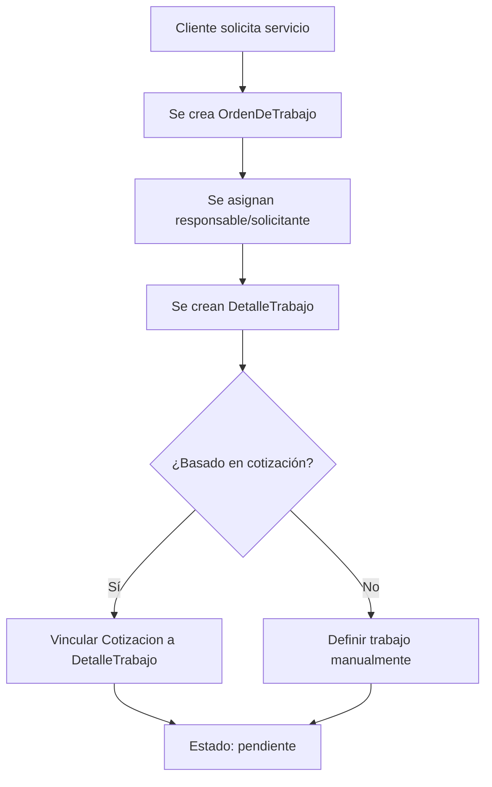
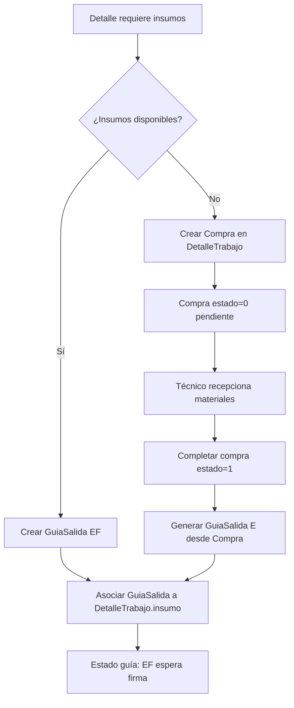
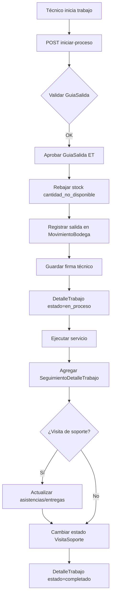
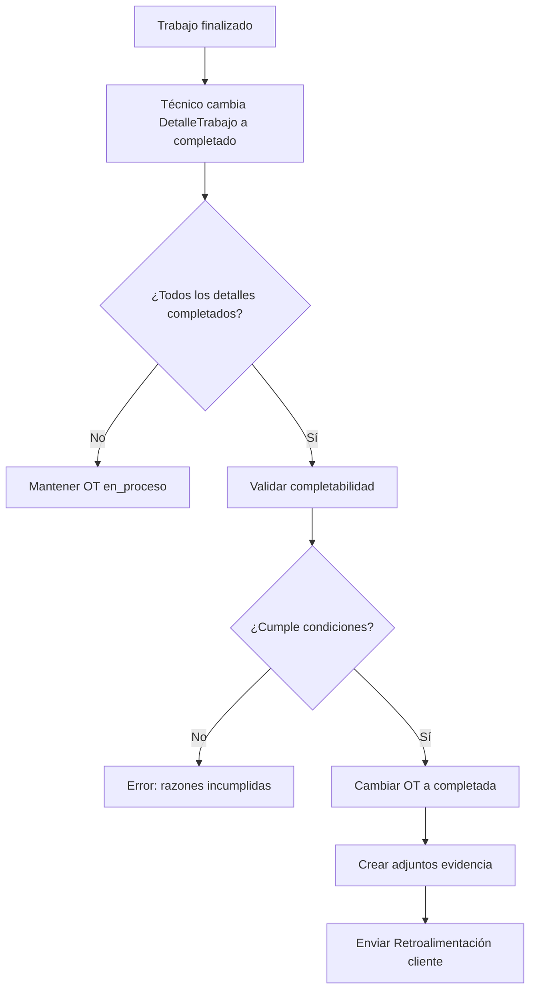
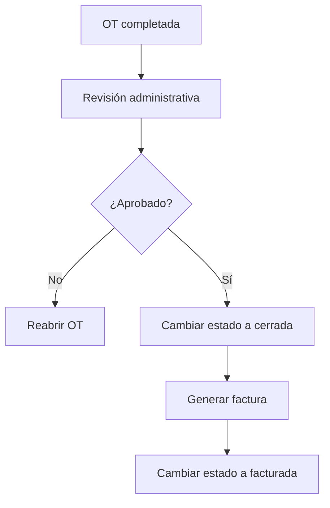
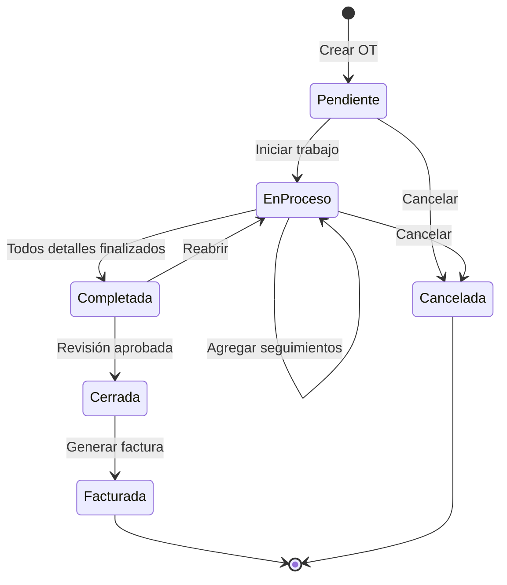

# Módulo de Orden de Trabajo (OT)

## 📋 Índice
1. [Visión General](#visión-general)
2. [Conceptos Fundamentales](#conceptos-fundamentales)
3. [Modelos del Sistema](#modelos-del-sistema)
4. [Ciclo de Vida de una OT](#ciclo-de-vida-de-una-ot)
5. [Flujos de Trabajo Principales](#flujos-de-trabajo-principales)
6. [Dependencias Críticas](#dependencias-críticas)
7. [API Endpoints](#api-endpoints)
8. [Casos de Uso Comunes](#casos-de-uso-comunes)
9. [Validaciones y Restricciones](#validaciones-y-restricciones)

---

## Visión General

El módulo de **Orden de Trabajo (OT)** es el corazón operativo del sistema ERP. Gestiona el ciclo completo de ejecución de trabajos/servicios, desde su solicitud hasta su cierre, integrando múltiples subsistemas:

- **Cotizaciones**: Trabajos derivados de cotizaciones aceptadas
- **Visitas de Soporte**: Servicios en terreno con asistencia y entregas de equipos
- **Compras**: Adquisiciones de insumos necesarios para el trabajo
- **Bodegas**: Gestión de inventario mediante guías de salida
- **Rendiciones**: Control de gastos asociados a la OT
- **Retroalimentación**: Encuestas de satisfacción post-servicio

### Propósito

Coordinar la ejecución de trabajos complejos que pueden involucrar:
- Múltiples técnicos y usuarios
- Consumo de inventario (guías de salida)
- Adquisición de materiales (compras)
- Servicios en terreno (visitas)
- Control de gastos y retroalimentación del cliente

---

## Conceptos Fundamentales

### 1. OrdenDeTrabajo (Modelo Principal)

La **Orden de Trabajo** es el contenedor principal que agrupa todos los elementos necesarios para ejecutar un servicio o proyecto.

**Campos clave:**
```python
- empresa: ForeignKey → Empresa que emite la OT
- cliente: ForeignKey → Empresa cliente que recibe el servicio
- fecha_inicio_ot / fecha_finalizacion_ot: Ventana temporal de ejecución
- estado: [pendiente, en_proceso, completada, cerrada, facturada, cancelada]
- prioridad: [alta=1, media=2, baja=3]
- descripcion: Descripción general del trabajo
- notas_internas: Información privada para la empresa
- responsable_empresa: UsuarioEmpresa responsable de la OT
- solicitante_empresa: UsuarioEmpresa que solicita el trabajo
```

**Estados del ciclo de vida:**
1. **Pendiente**: OT creada, esperando inicio
2. **En Proceso**: Trabajo en ejecución
3. **Completada**: Trabajo finalizado, pendiente de revisión
4. **Cerrada**: Trabajo cerrado administrativamente
5. **Facturada**: OT facturada al cliente
6. **Cancelada**: OT cancelada antes de completarse

### 2. DetalleTrabajo (Trabajo Específico)

Representa una **tarea concreta** dentro de la OT. Una OT puede tener múltiples detalles (ej: instalación, configuración, reparación).

**Características:**
```python
- nombre: Título del detalle
- descripcion: Descripción detallada
- orden: ForeignKey → OrdenDeTrabajo
- estado: [pendiente, en_proceso, medianamente_completado, completado, no_realizado]
- tecnico_asignado: UsuarioEmpresa responsable del detalle
- insumo: OneToOneField → GuiaSalida (materiales usados)
- trabajo (GenericForeignKey): Referencia polimórfica a Cotizacion/VisitaSoporte/Compra
```

**Relación polimórfica (GenericForeignKey):**
Un `DetalleTrabajo` puede vincularse a:
- **Cotización** (`cotizaciones.Cotizacion`): Trabajo basado en cotización aceptada
- **Visita de Soporte** (`visitas.VisitaSoporte`): Servicio en terreno
- **Compra** (`bodegas.Compra`): Adquisición de materiales

### 3. UsuarioAsignadoOT

Permite asignar múltiples usuarios a una OT (internos o externos).

**Validación XOR:**
```python
# Solo puede existir UNO de estos:
- usuario_empresa: UsuarioEmpresa (usuario interno)
- usuario_externo + correo_usuario_externo: Usuario externo (ej: subcontratista)
```

### 4. SeguimientoDetalleTrabajo

Bitácora de eventos en cada detalle de trabajo.

**Tipos de seguimiento:**
- **Actualización**: Cambio de estado o progreso
- **Incidencia**: Problema o bloqueo
- **Comentario**: Notas generales

### 5. HistorialCambiosOrden

Registro de modificaciones en la OT principal (estado, fechas, responsables).

### 6. AdjuntoDeOrden

Archivos relacionados con la OT.

**Tipos:**
- **Contrato**: Documentos legales
- **Imagen**: Fotos (ej: evidencia de trabajo completado)
- **Informe**: Reportes técnicos

### 7. DetalleGastoRendicionOT

Gastos operativos asociados a la OT (ej: transporte, materiales menores).

---

## Modelos del Sistema

### Diagrama de Relaciones

```
OrdenDeTrabajo (1)
├── (M) DetalleTrabajo
│   ├── (1) insumo → GuiaSalida (bodegas)
│   ├── (GFK) trabajo → Cotizacion | VisitaSoporte | Compra
│   ├── (1) tecnico_asignado → UsuarioEmpresa
│   └── (M) SeguimientoDetalleTrabajo
│       └── (1) usuario → UsuarioEmpresa
├── (M) UsuarioAsignadoOT
│   └── (1?) usuario_empresa → UsuarioEmpresa
├── (M) AdjuntoDeOrden
├── (M) HistorialCambiosOrden
│   └── (1) usuario → UsuarioEmpresa
├── (M) DetalleGastoRendicionOT
│   └── (1) categoria → CategoriaGastoRendicion
└── (M) Retroalimentacion (app retroalimentacion)
    └── (GFK) contenedor → OrdenDeTrabajo
```

### Herencia de ModeloBaseHistorico

Todos los modelos heredan de `ModeloBaseHistorico` (core), que proporciona:
- **Auditoría automática**: `fecha_creacion`, `fecha_modificacion`, `creado_por`, `modificado_por`
- **django-simple-history**: Tracking completo de cambios con `historia.all()`

---

## Ciclo de Vida de una OT

### Fase 1: Creación y Planificación



**Acciones:**
1. Crear `OrdenDeTrabajo` con `estado=pendiente`
2. Asignar `responsable_empresa` y `solicitante_empresa`
3. Crear uno o más `DetalleTrabajo`
4. Vincular trabajos existentes (cotizaciones, visitas) mediante `GenericForeignKey`
5. Asignar técnicos a cada detalle

### Fase 2: Preparación de Insumos



**Flujo de Insumos:**
1. **Si hay stock disponible:**
   - Admin crea `GuiaSalida` con estado `EF` (Espera Firma)
   - Vincula `GuiaSalida` a `DetalleTrabajo.insumo`

2. **Si no hay stock:**
   - Se crea una `Compra` vinculada al `DetalleTrabajo` (estado `0=pendiente`)
   - Al recepcionar materiales, se completa la compra (estado `1`)
   - Se genera automáticamente una `GuiaSalida` con estado `E` (Entregada)
   - Se asocia al `DetalleTrabajo.insumo`

### Fase 3: Ejecución del Trabajo



**Endpoint clave: `iniciar-proceso`**
```python
POST /api/ordenes-trabajo/{ot_pk}/detalles-trabajo/{detalle_pk}/iniciar-proceso/

Body:
{
  "firma_recibido_por": "data:image/svg+xml;base64,..."
}

Acciones:
1. Cambiar DetalleTrabajo a estado='en_proceso'
2. Validar que cantidad_rebajada ≤ cantidad_no_disponible en GuiaSalida
3. Rebajar stock reservado (cantidad_no_disponible)
4. Registrar salida de inventario (MovimientoBodega)
5. Cambiar GuiaSalida a estado='ET' (En Tránsito)
6. Guardar firma del técnico
```

### Fase 4: Completación



**Condiciones de completabilidad (`check-completabilidad`):**

Para marcar una OT como `completada`, **TODOS** los detalles deben cumplir:

1. **Estado del DetalleTrabajo**: Debe estar en uno de estos estados:
   - `medianamente_completado`
   - `completado`
   - `no_realizado`

2. **Estado de GuiaSalida** (si existe `insumo`): Debe estar en:
   - `T` (Terminada)
   - `R` (Rechazada)
   - `PR` (Parcialmente Rechazada)
   - `E` (Entregada)

3. **Estado de VisitaSoporte** (si el detalle es tipo `visitasoporte`):
   - `completada`
   - `cerrada`

**Endpoint:**
```python
GET /api/ordenes-trabajo/{ot_pk}/check-completabilidad/

Response:
{
  "se_puede_completar": false,
  "razones": [
    "Detalle 42: estado 'pendiente' no permite completar",
    "Detalle 43: insumo en estado 'Espera Firma'",
    "Detalle 44: visita soporte en estado 'En proceso'"
  ]
}
```

### Fase 5: Cierre y Facturación



---

## Flujos de Trabajo Principales

### 1. OT desde Cotización Aceptada

```python
# 1. Cliente acepta cotización
cotizacion.estado = "aceptada"
cotizacion.save()

# 2. Crear OT
ot = OrdenDeTrabajo.objects.create(
    empresa=empresa,
    cliente=cotizacion.cliente,
    descripcion="Trabajo de instalación",
    estado="pendiente",
    responsable_empresa=responsable
)

# 3. Crear detalle vinculado a cotización
ct_cotizacion = ContentType.objects.get(app_label='cotizaciones', model='cotizacion')
detalle = DetalleTrabajo.objects.create(
    orden=ot,
    nombre="Instalación según cotización #123",
    descripcion="...",
    content_type=ct_cotizacion,
    trabajo_id=cotizacion.id,
    tecnico_asignado=tecnico
)

# 4. Preparar insumos (guía de salida)
guia = GuiaSalida.objects.create(
    bodega=bodega,
    estado="EF",
    recibido_por=tecnico
)
# Agregar items a guía...

detalle.insumo = guia
detalle.save()
```

### 2. OT con Visita de Soporte

```python
# 1. Crear visita de soporte
visita = VisitaSoporte.objects.create(
    empresa=empresa,
    cliente=cliente,
    descripcion_servicio="Mantenimiento correctivo",
    estado="planificada"
)

# 2. Crear OT
ot = OrdenDeTrabajo.objects.create(...)

# 3. Vincular visita al detalle
ct_visita = ContentType.objects.get(app_label='visitas', model='visitasoporte')
detalle = DetalleTrabajo.objects.create(
    orden=ot,
    nombre="Visita técnica",
    content_type=ct_visita,
    trabajo_id=visita.id,
    tecnico_asignado=tecnico
)

# 4. Si la visita ya tiene guía de salida, asociarla automáticamente
if visita.guia_salida:
    detalle.insumo = visita.guia_salida
    detalle.save()
```

### 3. OT con Compra de Materiales

```python
# 1. Crear OT con detalle sin insumos
ot = OrdenDeTrabajo.objects.create(...)
detalle = DetalleTrabajo.objects.create(
    orden=ot,
    nombre="Reparación",
    estado="pendiente"
)

# 2. Técnico identifica necesidad de compra
POST /api/ordenes-trabajo/{ot_pk}/detalles-trabajo/{detalle_pk}/crear-compra/
{
  "proveedor": 5,
  "bodega_temporal": 2,
  "observaciones": "Cables de red",
  "items": [
    {"item": 10, "cantidad": 50, "precio_unitario": 500}
  ]
}

# 3. Sistema crea Compra y la vincula al DetalleTrabajo
compra = Compra.objects.create(estado='0')  # pendiente
ct_compra = ContentType.objects.get(app_label='bodegas', model='compra')
detalle.content_type = ct_compra
detalle.trabajo_id = compra.id
detalle.save()

# 4. Al recepcionar materiales
POST /api/ordenes-trabajo/{ot_pk}/detalles-trabajo/{detalle_pk}/completar-compra/
{
  "firma": "data:image/svg+xml;base64,..."
}

# Sistema:
# - Cambia compra.estado = '1' (completada)
# - Genera GuiaSalida con items de la compra
# - Registra entrada de stock (ItemOrdenCompraEnStock)
# - Registra salida inmediata hacia la guía
# - Asocia guía al detalle.insumo
# - Marca detalle como 'completado'
```

---

## Dependencias Críticas

### 1. Módulo `bodegas`

**Modelos:**
- `GuiaSalida`: Documento que autoriza salida de materiales
- `ItemsGuiaSalida`: Líneas de la guía con cantidad rebajada
- `StockItemEnBodega`: Stock disponible y reservado
- `Compra`: Órdenes de compra a proveedores
- `ItemEnCompra`: Líneas de items en compra
- `ItemOrdenCompraEnStock`: Items recepcionados en bodega temporal

**Funciones críticas:**
```python
from bodegas.movimientos import registrar_entrada, registrar_salida

registrar_entrada(
    stock_item=stock,
    cantidad=10,
    usuario=tecnico,
    origen=compra_item,
    descripcion="Items añadidos por compra en OT"
)

registrar_salida(
    stock_item=stock,
    cantidad=5,
    usuario=tecnico,
    origen=guia_item,
    descripcion="Items rebajados por guía de salida en OT"
)
```

**Estados de GuiaSalida relevantes:**
- `EF`: Espera Firma (guía creada, esperando técnico)
- `ET`: En Tránsito (aprobada, técnico tiene materiales)
- `E`: Entregada (materiales entregados a cliente)
- `T`: Terminada (guía cerrada)
- `R`: Rechazada
- `PR`: Parcialmente Rechazada

### 2. Módulo `visitas`

**Modelo `VisitaSoporte`:**
```python
- empresa: Empresa proveedora
- cliente: Empresa cliente
- descripcion_servicio: Descripción del trabajo
- estado: [planificada, en_proceso, completada, cerrada, cancelada]
- guia_salida: ForeignKey opcional a GuiaSalida
```

**Relaciones:**
- `AsistenciaUsuario`: Asistencias de usuarios en la visita
  - `estado_revision`: [pendiente, aprobado, rechazado]
- `EntregaDeEquipo`: Equipos entregados en la visita
  - `estado_entrega`: [pendiente, entregado, no_entregado]

**Endpoints usados por OT:**
```python
GET /api/ordenes-trabajo/{ot_pk}/detalles-trabajo/{detalle_pk}/detalles-con-visitas/
# Retorna datos completos de la visita vinculada

PATCH /api/ordenes-trabajo/{ot_pk}/detalles-trabajo/{detalle_pk}/actualizar-estado/
Body: { "tipo": "asistencia", "id": 42, "estado": "aprobado" }
# Actualiza estado de asistencias/entregas
```

### 3. Módulo `cotizaciones`

**Modelo `Cotizacion`:**
```python
- empresa: Empresa proveedora
- cliente: Empresa cliente
- numero_cotizacion: Código único
- estado: [borrador, enviada, aceptada, rechazada, vencida]
- items: Líneas de items cotizados
```

**Restricción:**
Solo cotizaciones con `estado='aceptada'` pueden vincularse a `DetalleTrabajo`.

**Endpoint:**
```python
GET /api/ordenes-trabajo/{ot_pk}/detalles-trabajo/trabajos-disponibles/
# Lista cotizaciones aceptadas y visitas no asignadas a otros detalles
```

### 4. Módulo `empresas`

**Modelo `UsuarioEmpresa`:**
```python
- usuario: ForeignKey → User (core)
- empresa: ForeignKey → Empresa
- sucursal: ForeignKey → SucursalEmpresa
- cargo: CharField
```

**Uso en OT:**
- `OrdenDeTrabajo.responsable_empresa`: Coordinador de la OT
- `OrdenDeTrabajo.solicitante_empresa`: Quien solicita el trabajo
- `DetalleTrabajo.tecnico_asignado`: Ejecutor del trabajo
- `UsuarioAsignadoOT.usuario_empresa`: Participantes adicionales

### 5. Módulo `rendiciones`

**Modelo `CategoriaGastoRendicion`:**
```python
- nombre: Ej. "Transporte", "Alimentación"
- descripcion: Detalle de la categoría
```

**Uso:**
```python
DetalleGastoRendicionOT.objects.create(
    orden=ot,
    categoria=categoria,
    detalle="Combustible viaje a obra",
    cantidad=1,
    monto_unitario=15000,
    fecha_gasto=timezone.now().date()
)
# monto_total se calcula automáticamente
```

### 6. Módulo `retroalimentacion`

**Modelo `Retroalimentacion`:**
```python
- uuid: UUID único para link público
- contenedor (GenericForeignKey): OrdenDeTrabajo
- usuario_empresa: UsuarioEmpresa o datos externos
- cantidad_estrellas: IntegerField (1-5)
- observacion_retroalimentacion: TextField
- fecha_retroalimentacion: DateTimeField
- cantidad_visitas: Contador de accesos al link
```

**Flujo:**
1. Al completar OT, se envía email con link único: `/feedback/{uuid}`
2. Cliente accede sin autenticación
3. Completa encuesta (estrellas + comentario)
4. Se guarda en `Retroalimentacion`

---

## API Endpoints

### OrdenDeTrabajo

```python
# CRUD básico
GET    /api/ordenes-trabajo/              # Listar OTs
POST   /api/ordenes-trabajo/              # Crear OT
GET    /api/ordenes-trabajo/{id}/         # Detalle OT
PATCH  /api/ordenes-trabajo/{id}/         # Actualizar OT
DELETE /api/ordenes-trabajo/{id}/         # Eliminar OT

# Acciones especiales
GET /api/ordenes-trabajo/{id}/history/
# Historial completo de cambios (django-simple-history)
# Retorna lista de modificaciones con diffs

GET /api/ordenes-trabajo/{id}/detalles-seguimientos-visitas/
# Lista detalles con seguimientos y datos de visitas vinculadas

GET /api/ordenes-trabajo/{id}/insumos/
# Lista detalles con GuiaSalida asociada

GET /api/ordenes-trabajo/{id}/check-completabilidad/
# Valida si la OT puede marcarse como completada
# Response: { "se_puede_completar": bool, "razones": [str] }
```

### DetalleTrabajo (nested bajo OT)

```python
# CRUD básico
GET    /api/ordenes-trabajo/{ot_pk}/detalles-trabajo/
POST   /api/ordenes-trabajo/{ot_pk}/detalles-trabajo/
GET    /api/ordenes-trabajo/{ot_pk}/detalles-trabajo/{id}/
PATCH  /api/ordenes-trabajo/{ot_pk}/detalles-trabajo/{id}/
DELETE /api/ordenes-trabajo/{ot_pk}/detalles-trabajo/{id}/
# Solo permite eliminar si estado='pendiente'

# Endpoints de gestión
GET /api/ordenes-trabajo/{ot_pk}/detalles-trabajo/trabajos-disponibles/
# Lista cotizaciones aceptadas y visitas no asignadas
# Response: { "cotizaciones": [...], "visitas_soporte": [...] }

GET /api/ordenes-trabajo/{ot_pk}/detalles-trabajo/guias-disponibles/
# Lista GuiaSalida en estado='EF' no asociadas a otros detalles

GET /api/ordenes-trabajo/{ot_pk}/detalles-trabajo/detalles-sin-insumo/
# Lista detalles sin GuiaSalida, vinculados a Cotizacion o sin trabajo

GET /api/ordenes-trabajo/{ot_pk}/detalles-trabajo/lista-compras/
# Lista detalles vinculados a Compras

# Acciones de ejecución
POST /api/ordenes-trabajo/{ot_pk}/detalles-trabajo/{id}/iniciar-proceso/
Body: { "firma_recibido_por": "data:image/svg+xml;base64,..." }
# Aprueba GuiaSalida, rebaja stock, cambia estado a 'en_proceso'

POST /api/ordenes-trabajo/{ot_pk}/detalles-trabajo/{id}/asociar-trabajo/
Body: { "content_type": 5, "trabajo_id": 123 }
# Vincula Cotizacion/VisitaSoporte/Compra al detalle

POST /api/ordenes-trabajo/{ot_pk}/detalles-trabajo/{id}/asignar-insumo/
Body: { "insumo": 42 }
# Asocia GuiaSalida existente al detalle

POST /api/ordenes-trabajo/{ot_pk}/detalles-trabajo/{id}/crear-compra/
Body: { "proveedor": 5, "items": [...] }
# Crea Compra y la vincula al detalle

POST /api/ordenes-trabajo/{ot_pk}/detalles-trabajo/{id}/completar-compra/
Body: { "firma": "data:image/svg+xml;base64,..." }
# Completa compra, genera GuiaSalida, registra movimientos

# Visitas de soporte
GET /api/ordenes-trabajo/{ot_pk}/detalles-trabajo/{id}/detalles-con-visitas/
# Detalle de visita con asistencias y entregas

PATCH /api/ordenes-trabajo/{ot_pk}/detalles-trabajo/{id}/actualizar-estado/
Body: { "tipo": "asistencia", "id": 42, "estado": "aprobado" }
# Actualiza estado de asistencias/entregas
```

### SeguimientoDetalleTrabajo

```python
GET    /api/ordenes-trabajo/{ot_pk}/detalles-trabajo/{det_pk}/seguimientos/
POST   /api/ordenes-trabajo/{ot_pk}/detalles-trabajo/{det_pk}/seguimientos/
GET    /api/ordenes-trabajo/{ot_pk}/detalles-trabajo/{det_pk}/seguimientos/{id}/
PATCH  /api/ordenes-trabajo/{ot_pk}/detalles-trabajo/{det_pk}/seguimientos/{id}/
DELETE /api/ordenes-trabajo/{ot_pk}/detalles-trabajo/{det_pk}/seguimientos/{id}/
```

### HistorialCambiosOrden

```python
GET    /api/ordenes-trabajo/{ot_pk}/historial-cambios-orden/
POST   /api/ordenes-trabajo/{ot_pk}/historial-cambios-orden/
# ...
```

### AdjuntoDeOrden

```python
GET  /api/ordenes-trabajo/{ot_pk}/adjuntos/
POST /api/ordenes-trabajo/{ot_pk}/adjuntos/

# Subida masiva de imágenes
POST /api/ordenes-trabajo/{ot_pk}/adjuntos/bulk/
Body (multipart o JSON):
{
  "descripcion": "Fotos equipo instalado",
  "imagenes": [
    <file>,  # multipart
    "data:image/png;base64,iVBORw0K..."  # o Base64
  ]
}
# Crea múltiples AdjuntoDeOrden con una misma descripción
```

### DetalleGastoRendicionOT

```python
GET    /api/ordenes-trabajo/{ot_pk}/detalles-gastos/
POST   /api/ordenes-trabajo/{ot_pk}/detalles-gastos/
# ...
```

### UsuarioAsignadoOT

```python
GET    /api/ordenes-trabajo/{ot_pk}/usuarios-vinculados/
POST   /api/ordenes-trabajo/{ot_pk}/usuarios-vinculados/
Body: { "usuario_empresa": 5 }  # o { "usuario_externo": "Juan", "correo_usuario_externo": "..." }
# ...
```

### Retroalimentacion

```python
GET    /api/ordenes-trabajo/{ot_pk}/retroalimentaciones/
POST   /api/ordenes-trabajo/{ot_pk}/retroalimentaciones/
# ...
```

---

## Casos de Uso Comunes

### Caso 1: Crear OT desde cotización aceptada

**Frontend:**
```typescript
// 1. Listar cotizaciones aceptadas del cliente
const response = await BaseService.get<Cotizacion[]>(
  '/api/cotizaciones/',
  { estado: 'aceptada', cliente: clienteId }
);

// 2. Crear OT
const ot = await BaseService.post<OrdenDeTrabajo>(
  '/api/ordenes-trabajo/',
  {
    empresa: empresaId,
    cliente: clienteId,
    descripcion: 'Instalación de equipos',
    prioridad: '1',
    responsable_empresa: responsableId,
    solicitante_empresa: solicitanteId
  }
);

// 3. Crear detalle vinculado a cotización
const detalle = await BaseService.post<DetalleTrabajo>(
  `/api/ordenes-trabajo/${ot.id}/detalles-trabajo/`,
  {
    nombre: `Trabajo cotización #${cotizacion.numero_cotizacion}`,
    descripcion: cotizacion.descripcion,
    content_type: cotizacionContentTypeId,
    trabajo_id: cotizacion.id,
    tecnico_asignado: tecnicoId
  }
);
```

### Caso 2: Asignar insumos desde bodega

**Frontend:**
```typescript
// 1. Listar guías disponibles
const guias = await BaseService.get<GuiaSalida[]>(
  `/api/ordenes-trabajo/${otId}/detalles-trabajo/guias-disponibles/`
);

// 2. Asignar guía al detalle
await BaseService.post(
  `/api/ordenes-trabajo/${otId}/detalles-trabajo/${detalleId}/asignar-insumo/`,
  { insumo: guiaId }
);
```

### Caso 3: Iniciar trabajo (técnico en terreno)

**Mobile App:**
```typescript
// 1. Obtener detalle asignado
const detalle = await BaseService.get<DetalleTrabajo>(
  `/api/ordenes-trabajo/${otId}/detalles-trabajo/${detalleId}/`
);

// 2. Verificar que hay guía asignada
if (!detalle.insumo) {
  throw new Error('No hay insumos asignados');
}

// 3. Capturar firma del técnico
const firma = await capturarFirma(); // Canvas SVG

// 4. Iniciar proceso
await BaseService.post(
  `/api/ordenes-trabajo/${otId}/detalles-trabajo/${detalleId}/iniciar-proceso/`,
  { firma_recibido_por: firma }
);

// Esto:
// - Cambia detalle a 'en_proceso'
// - Aprueba guía (estado 'ET')
// - Rebaja stock reservado
// - Registra movimiento de salida
```

### Caso 4: Agregar seguimiento durante trabajo

**Mobile App:**
```typescript
await BaseService.post(
  `/api/ordenes-trabajo/${otId}/detalles-trabajo/${detalleId}/seguimientos/`,
  {
    tipo: 'actualizacion',
    comentario: 'Instalación 50% completada. Falta configuración de red.',
    usuario: usuarioEmpresaId
  }
);
```

### Caso 5: Completar trabajo y subir evidencia

**Mobile App:**
```typescript
// 1. Marcar detalle como completado
await BaseService.patch(
  `/api/ordenes-trabajo/${otId}/detalles-trabajo/${detalleId}/`,
  { estado: 'completado' }
);

// 2. Subir fotos de evidencia
const formData = new FormData();
formData.append('descripcion', 'Equipo instalado y funcionando');
fotos.forEach(foto => formData.append('imagenes', foto));

await BaseService.post(
  `/api/ordenes-trabajo/${otId}/adjuntos/bulk/`,
  formData
);
```

### Caso 6: Completar OT y enviar retroalimentación

**Frontend:**
```typescript
// 1. Verificar completabilidad
const check = await BaseService.get(
  `/api/ordenes-trabajo/${otId}/check-completabilidad/`
);

if (!check.se_puede_completar) {
  alert(`No se puede completar:\n${check.razones.join('\n')}`);
  return;
}

// 2. Cambiar estado a completada
await BaseService.patch(
  `/api/ordenes-trabajo/${otId}/`,
  { estado: 'completada' }
);

// 3. Crear retroalimentación
await BaseService.post(
  `/api/ordenes-trabajo/${otId}/retroalimentaciones/`,
  {
    usuario_empresa: clienteContactoId,
    // Sistema enviará email con link /feedback/{uuid}
  }
);
```

---

## Validaciones y Restricciones

### 1. OrdenDeTrabajo

```python
def clean(self):
    if self.fecha_inicio_ot and self.fecha_finalizacion_ot:
        if self.fecha_finalizacion_ot < self.fecha_inicio_ot:
            raise ValidationError(
                "La fecha de finalización no puede ser anterior a la fecha de inicio."
            )
```

### 2. UsuarioAsignadoOT (Constraint XOR)

```python
constraints = [
    models.CheckConstraint(
        check=(
            # Solo usuario interno
            (Q(usuario_empresa__isnull=False) & 
             Q(usuario_externo__isnull=True) & 
             Q(correo_usuario_externo__isnull=True)) |
            # O solo usuario externo
            (Q(usuario_empresa__isnull=True) & 
             Q(usuario_externo__isnull=False))
        ),
        name="usuario_empresa_xor_usuario_externo"
    )
]

def clean(self):
    if self.usuario_empresa and (self.usuario_externo or self.correo_usuario_externo):
        raise ValidationError(
            "No puede asignar ambos: usuario_empresa y usuario_externo."
        )
    if not self.usuario_empresa and not self.usuario_externo:
        raise ValidationError(
            "Debe asignar un usuario_empresa o un usuario_externo."
        )
```

### 3. DetalleTrabajo - Eliminación

```python
def destroy(self, request, *args, **kwargs):
    detalle: DetalleTrabajo = self.get_object()
    
    if detalle.estado != "pendiente":
        raise ValidationError(
            "Solo se pueden eliminar detalles con estado «pendiente»."
        )
    
    # Si tiene Compra asociada, eliminarla en cascada
    if (detalle.content_type and 
        detalle.content_type.model == "compra" and 
        detalle.trabajo):
        detalle.trabajo.delete()
    
    detalle.delete()
    return Response(status=status.HTTP_204_NO_CONTENT)
```

### 4. DetalleTrabajo - Validación de inicio

```python
# En iniciar-proceso
for item in ItemsGuiaSalida.objects.filter(guia=guia):
    if item.cantidad_rebajada > item.stock_item.cantidad_no_disponible:
        raise ValueError(
            f"La cantidad a rebajar ({item.cantidad_rebajada}) "
            f"excede el stock reservado "
            f"({item.stock_item.cantidad_no_disponible}) "
            f"para el ítem {item.stock_item.item}."
        )
```

### 5. Restricciones de estado

**DetalleTrabajo:**
- Solo puede iniciarse (`en_proceso`) si tiene `insumo` asignado
- Solo puede completarse si su `insumo` está en estado válido (`T`, `R`, `PR`, `E`)
- Solo puede eliminarse si está en estado `pendiente`

**OrdenDeTrabajo:**
- Solo puede completarse si **todos** los detalles están en estados finales
- Solo puede cerrarse si está `completada`
- Solo puede facturarse si está `cerrada`

### 6. Restricciones de unicidad

**GuiaSalida en DetalleTrabajo:**
```python
# En asociar-trabajo (para VisitaSoporte)
otro = DetalleTrabajo.objects.filter(insumo=guia).exclude(pk=detalle.pk).first()
if otro:
    return Response(
        {"detail": f"La Guía {guia.pk} ya está asociada al DetalleTrabajo #{otro.pk}"},
        status=status.HTTP_409_CONFLICT
    )
```

---

## Diagrama de Estados Completo



---

## Consideraciones de Performance

### 1. Queries N+1

**Problema:**
```python
# ❌ Genera queries por cada OT
ordenes = OrdenDeTrabajo.objects.all()
for ot in ordenes:
    print(ot.responsable_empresa.usuario.get_nombre())
```

**Solución:**
```python
# ✅ Una sola query con joins
ordenes = OrdenDeTrabajo.objects.select_related(
    'empresa',
    'cliente',
    'responsable_empresa__usuario',
    'solicitante_empresa__usuario'
).prefetch_related(
    'detalletrabajo_set__insumo',
    'detalletrabajo_set__tecnico_asignado'
)
```

### 2. Historial de cambios

El endpoint `history` puede ser costoso en OTs con muchos cambios. Se recomienda:
- Paginar resultados
- Filtrar por rango de fechas
- Limitar profundidad de diff

### 3. Validación de completabilidad

`check-completabilidad` ejecuta múltiples queries. Cachear resultado:
```python
from django.core.cache import cache

cache_key = f'ot_{ot_id}_completabilidad'
resultado = cache.get(cache_key)
if not resultado:
    resultado = validar_completabilidad(ot)
    cache.set(cache_key, resultado, 300)  # 5 minutos
```

---

## Integración con Frontend

### Redux Slices Relacionados

Ver `frontend/src/store/`:
- `ordenestrabajoSlice.ts`: Estado de OTs
- `detalletrabajoSlice.ts`: Estado de detalles
- Thunks asíncronos para operaciones complejas

### Ejemplo de Thunk

```typescript
// frontend/src/store/ordenestrabajoSlice.ts
export const iniciarProcesoDetalle = createAsyncThunk(
  'ordentrabajo/iniciarProceso',
  async ({ otId, detalleId, firma }: Params, { rejectWithValue }) => {
    try {
      const response = await BaseService.post(
        `/api/ordenes-trabajo/${otId}/detalles-trabajo/${detalleId}/iniciar-proceso/`,
        { firma_recibido_por: firma }
      );
      return response.data;
    } catch (error) {
      return rejectWithValue(error.response.data);
    }
  }
);
```

---

## Troubleshooting Común

### 1. "No se puede completar la OT"

**Causa:** Algún detalle no cumple condiciones de completabilidad.

**Solución:**
```bash
GET /api/ordenes-trabajo/{id}/check-completabilidad/
# Revisar campo "razones"
```

Posibles problemas:
- Detalle en estado `pendiente` o `en_proceso`
- GuiaSalida en estado `EF` (no aprobada)
- VisitaSoporte en estado `planificada` (no ejecutada)

### 2. "Error al iniciar proceso: cantidad excede stock reservado"

**Causa:** La guía de salida tiene `cantidad_rebajada` mayor que `cantidad_no_disponible` en stock.

**Solución:**
1. Verificar stock en bodega
2. Ajustar `cantidad_rebajada` en `ItemsGuiaSalida`
3. O aumentar reserva en `StockItemEnBodega.cantidad_no_disponible`

### 3. "No se puede eliminar DetalleTrabajo"

**Causa:** Solo se permite eliminar detalles en estado `pendiente`.

**Solución:**
- Cambiar estado a `pendiente` si es posible
- O usar `PATCH` para desactivar en lugar de eliminar

### 4. "Guía ya asociada a otro detalle"

**Causa:** Una `GuiaSalida` solo puede vincularse a un `DetalleTrabajo`.

**Solución:**
- Desvincular de detalle anterior
- O crear nueva guía desde bodega

---

## Scripts de Utilidad

### Generar reporte de OTs pendientes

```python
# backend/scripts/ordentrabajo/reporte_pendientes.py
from ordentrabajo.models import OrdenDeTrabajo
from django.utils import timezone

ots_pendientes = OrdenDeTrabajo.objects.filter(
    estado='pendiente',
    fecha_inicio_ot__lte=timezone.now().date()
).select_related('empresa', 'cliente', 'responsable_empresa')

for ot in ots_pendientes:
    print(f"OT #{ot.id}: {ot.descripcion}")
    print(f"  Cliente: {ot.cliente.nombre}")
    print(f"  Responsable: {ot.responsable_empresa.usuario.get_nombre()}")
    print(f"  Inicio programado: {ot.fecha_inicio_ot}")
    print()
```

### Completar automáticamente OTs finalizadas

```python
# backend/scripts/ordentrabajo/autocompletar.py
from ordentrabajo.models import OrdenDeTrabajo, DetalleTrabajo

ots_candidatas = OrdenDeTrabajo.objects.filter(estado='en_proceso')

for ot in ots_candidatas:
    detalles = DetalleTrabajo.objects.filter(orden=ot)
    
    if all(d.estado in ['completado', 'medianamente_completado', 'no_realizado'] 
           for d in detalles):
        ot.estado = 'completada'
        ot.save()
        print(f"OT #{ot.id} completada automáticamente")
```

---

## Próximos Pasos

1. **Notificaciones en tiempo real**: Usar Django Channels para notificar cambios de estado
2. **Geolocalización**: Registrar ubicación del técnico al iniciar detalle
3. **Firmas electrónicas avanzadas**: Integrar con servicio de firma digital certificada
4. **IA para sugerencias**: Predecir tiempos de ejecución basado en historial
5. **Reportes avanzados**: Dashboard con métricas de productividad por técnico

---

## Referencias

- **Documentación Django Simple History**: https://django-simple-history.readthedocs.io/
- **GenericForeignKey**: https://docs.djangoproject.com/en/5.1/ref/contrib/contenttypes/
- **Documentación interna**:
  - [Arquitectura del Sistema](./ARQUITECTURA_SISTEMA.md)
  - [Módulo Bodegas](./instructions/backend/contratos-bodegas-items.md)
  - [Módulo Visitas](./instructions/backend/ordentrabajo-recursos-rendiciones-visitas.md)

---

**Última actualización**: 2025-01-05
**Autor**: Documentación generada por análisis de código
**Versión**: 1.0.0
