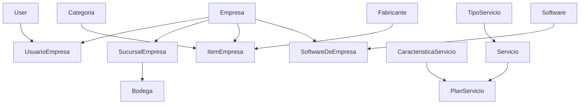

# Modelo de Datos del Sistema ERP

> **Objetivo**: Documentar **todas las entidades** del sistema, clasificándolas en datos maestros (catálogos que requieren entrada manual) y datos transaccionales (generados automáticamente por el sistema). Incluye dependencias, flujos de creación y estrategia de seed data.

**Fecha**: 2025-01-07  
**Versión**: 1.0

---

## Índice

1. [Introducción](#1-introducción)
2. [Clasificación de Entidades](#2-clasificación-de-entidades)
3. [Catálogos Base (Datos Maestros)](#3-catálogos-base-datos-maestros)
4. [Entidades Transaccionales](#4-entidades-transaccionales)
5. [Grafo de Dependencias](#5-grafo-de-dependencias)
6. [Flujos de Creación](#6-flujos-de-creación)
7. [Estrategia de Seed Data](#7-estrategia-de-seed-data)
8. [Scripts Actuales vs. Necesarios](#8-scripts-actuales-vs-necesarios)

---

## 1. Introducción

Este sistema ERP maneja dos tipos fundamentales de datos:

### 1.1. **Catálogos Base (Datos Maestros)**
Entidades que **deben existir antes** de poder operar el sistema. Se ingresan manualmente o mediante scripts de seed. Son relativamente **estáticos** y se crean durante la inicialización del sistema.

**Características**:
- Se crean una vez y se modifican poco
- Son prerequisitos para operaciones transaccionales
- Ejemplos: Empresas, Usuarios, Items, Servicios, Bodegas

### 1.2. **Entidades Transaccionales**
Registros que **se generan automáticamente** durante la operación del sistema mediante acciones de usuarios o procesos automatizados.

**Características**:
- Se crean dinámicamente durante el uso del sistema
- Dependen de catálogos base
- Ejemplos: Contratos, Órdenes de Trabajo, Movimientos de Stock, Firmas

---

## 2. Clasificación de Entidades

### Leyenda de Símbolos
- 🔵 **Catálogo Base**: Requiere entrada manual/seed
- 🟢 **Transaccional**: Generado por el sistema
- 🟡 **Mixto**: Puede ser catálogo o transaccional según contexto
- ⚠️ **Critical**: Sin este catálogo, módulos completos no funcionan

---

## 3. Catálogos Base (Datos Maestros)

### 3.1. **Core (Autenticación y Configuración)**

| Entidad | Tipo | Descripción | Prerequisitos | Script Actual |
|---------|------|-------------|---------------|---------------|
| `User` | 🔵⚠️ | Usuarios del sistema (Django auth) | Ninguno | `setup_superuser.py` |
| `Group` | 🔵 | Grupos de permisos | User | Manual/Admin |
| `PersonalizacionUsuario` | 🔵 | Configuración UI por usuario | User | Automático |
| `Software` | 🔵 | Catálogo de software global | Ninguno | ❌ Falta |
| `PreguntaEnRetroalimentacion` | 🔵 | Plantillas de preguntas | Ninguno | ❌ Falta |

### 3.2. **Empresas (Multi-tenancy)**

| Entidad | Tipo | Descripción | Prerequisitos | Script Actual |
|---------|------|-------------|---------------|---------------|
| `Empresa` | 🔵⚠️ | Empresas del sistema | Ninguno | `seed_data.py` ✅ |
| `SucursalEmpresa` | 🔵⚠️ | Sucursales de empresas | Empresa | `seed_data.py` ✅ |
| `UsuarioEmpresa` | 🔵⚠️ | Vinculación User↔Empresa | User + Empresa | `seed_data.py` ✅ |
| `RelacionEmpresa` | 🔵 | Relación entre empresas (proveedor/cliente) | 2 Empresas | ❌ Falta |

**Nota**: `Empresa` con `rut_empresa='11111111-1'` es la **empresa base** requerida por muchos scripts.

### 3.3. **Items (Productos y Servicios)**

| Entidad | Tipo | Descripción | Prerequisitos | Script Actual |
|---------|------|-------------|---------------|---------------|
| `Categoria` | 🔵 | Categorías de items | Ninguno | `seed_data.py` ✅ |
| `Fabricante` | 🔵 | Fabricantes de productos | Ninguno | `seed_data.py` ✅ |
| `ProveedorEmpresa` | 🔵 | Proveedores por empresa | Empresa | ❌ Falta |
| `CampoAdicionalProveedor` | 🔵 | Metadatos custom de proveedor | ProveedorEmpresa | Manual |
| `ItemEmpresa` | 🔵⚠️ | Items de inventario | Empresa + Categoria + Fabricante | `seed_data.py` ✅ |
| `ImagenItem` | 🔵 | Imágenes de items | ItemEmpresa | Manual/Upload |

**Flujo**: Para que existan **Equipos** serializados, primero deben existir `ItemEmpresa` que se ingresan mediante **Orden de Compra** (ver sección transaccional).

### 3.4. **Bodegas (Almacenamiento)**

| Entidad | Tipo | Descripción | Prerequisitos | Script Actual |
|---------|------|-------------|---------------|---------------|
| `Bodega` | 🔵⚠️ | Bodegas físicas | SucursalEmpresa | `seed_data.py` ✅ |
| `StockItemEnBodega` | 🟡 | Stock de item en bodega | Bodega + ItemEmpresa | Automático al crear Compra |

**Nota**: `StockItemEnBodega` se crea automáticamente al procesar Compras, pero requiere que la bodega exista.

### 3.5. **Contratos (Servicios y Planes)**

| Entidad | Tipo | Descripción | Prerequisitos | Script Actual |
|---------|------|-------------|---------------|---------------|
| `TipoServicio` | 🔵 | Tipos de servicio (Instalación, Mantenimiento, etc.) | Ninguno | `seed_servicios.py` ✅ |
| `Servicio` | 🔵⚠️ | Servicios individuales | TipoServicio | `seed_servicios.py` ✅ |
| `CaracteristicaServicio` | 🔵 | Características de servicios | Ninguno | `seed_servicios.py` ✅ |
| `PlanServicio` | 🔵⚠️ | Planes (bundles de servicios) | Servicio + CaracteristicaServicio | `seed_servicios.py` ✅ |
| `Visita` | 🔵 | Tipos de visitas programadas | Ninguno | ❌ Falta |
| `Licencia` | 🔵 | Catálogo de licencias | Ninguno | ❌ Falta |
| `CondicionEspecial` | 🔵 | Condiciones legales/comerciales | Ninguno | ❌ Falta |

**Crítico**: Sin `Servicio` y `PlanServicio`, **no se pueden crear contratos** ni mostrar opciones en el frontend.

### 3.6. **Recursos (Equipos)**

| Entidad | Tipo | Descripción | Prerequisitos | Script Actual |
|---------|------|-------------|---------------|---------------|
| `Equipo` | 🟡⚠️ | Equipos computacionales | ItemEmpresa serializado + UsuarioEmpresa | Creación manual |
| `SoftwareDeEmpresa` | 🔵 | Software disponible en empresa | Software + Empresa | ❌ Falta |
| `MonitorEquipo` | 🔵 | Monitores | Equipo | Manual |

**Flujo de Equipos**:
1. Se crea `ItemEmpresa` (ej: "Notebook HP")
2. Se ingresa a bodega mediante **Orden de Compra** con números de serie
3. Se crea `Equipo` referenciando el número de serie del item serializado
4. Se asigna a usuario mediante `UsuarioEquipo`

**⚠️ Punto clave**: `Equipo` es **mixto** porque aunque se ingresa manualmente, **depende críticamente** de que exista un `ItemEmpresa` con número de serie registrado en una Orden de Compra.

### 3.7. **Geografía (BD Ciudades)**

| Entidad | Tipo | Descripción | Prerequisitos | Script Actual |
|---------|------|-------------|---------------|---------------|
| `Region` | 🔵 | Regiones de Chile | Ninguno | ❌ Falta (probablemente fixture) |
| `Provincia` | 🔵 | Provincias | Region | ❌ Falta |
| `Comuna` | 🔵 | Comunas | Provincia | ❌ Falta |

**Nota**: Estos datos son estáticos y deberían cargarse mediante fixture JSON una sola vez.

### 3.8. **Rendiciones (Categorías de Gastos)**

| Entidad | Tipo | Descripción | Prerequisitos | Script Actual |
|---------|------|-------------|---------------|---------------|
| `CategoriaGastoRendicion` | 🔵 | Categorías de gastos (Transporte, Alimentación, etc.) | Ninguno | ❌ Falta |

---

## 4. Entidades Transaccionales

### 4.1. **Contratos (Gestión Contractual)**

| Entidad | Tipo | Descripción | Trigger de Creación |
|---------|------|-------------|---------------------|
| `ContratoEmpresaCliente` | 🟢 | Contrato entre empresas | Usuario crea desde frontend/API |
| `ContratoServicio` | 🟢 | Servicios/Planes en contrato | Usuario agrega servicios al contrato |
| `ContratoVisita` | 🟢 | Visitas programadas | Usuario configura visitas |
| `ContratoLicencia` | 🟢 | Licencias asignadas | Usuario agrega licencias |
| `ContratoCondicionEspecial` | 🟢 | Condiciones aplicadas | Usuario selecciona condiciones |
| `UsuarioVinculadoContrato` | 🟢 | Usuarios en contrato | Usuario agrega usuarios vinculados |
| `UsuarioVinculadoLicencia` | 🟢 | Usuarios asignados a licencia | Usuario asigna licencias a usuarios |
| `EnvioContratoFirmaUsuario` | 🟢 | Invitaciones de firma digital | Usuario envía firma (genera UUID) |
| `AcuerdoConfidencialidadContrato` | 🟢 | Firmas de confidencialidad | Usuario firma acuerdo |

**Flujo típico**:
1. Usuario crea `ContratoEmpresaCliente` (borrador)
2. Agrega servicios → `ContratoServicio`
3. Agrega visitas → `ContratoVisita`
4. Agrega usuarios → `UsuarioVinculadoContrato`
5. Envía firma → `EnvioContratoFirmaUsuario` (genera UUID)
6. Usuario firma → actualiza `firmado=True`
7. Contrato pasa a estado `activo`

### 4.2. **Órdenes de Trabajo**

| Entidad | Tipo | Descripción | Trigger de Creación |
|---------|------|-------------|---------------------|
| `OrdenDeTrabajo` | 🟢 | OT principal | Usuario crea desde frontend |
| `UsuarioAsignadoOT` | 🟢 | Técnicos asignados | Usuario asigna técnicos |
| `DetalleTrabajo` | 🟢 | Trabajos específicos en OT | Usuario descompone OT |
| `SeguimientoDetalleTrabajo` | 🟢 | Comentarios/seguimiento | Usuario comenta trabajo |
| `HistorialCambiosOrden` | 🟢 | Auditoría de cambios | Sistema registra cambios |
| `AdjuntoDeOrden` | 🟢 | Archivos adjuntos | Usuario sube archivos |
| `DetalleGastoRendicionOT` | 🟢 | Gastos de OT | Usuario registra gastos |

### 4.3. **Bodegas (Transacciones de Stock)**

| Entidad | Tipo | Descripción | Trigger de Creación |
|---------|------|-------------|---------------------|
| `OrdenCompra` | 🟢 | OC a proveedor | Usuario crea OC |
| `ItemEnOrdenCompra` | 🟢 | Items en OC | Usuario agrega items a OC |
| `Compra` | 🟢 | Registro de compra real | Usuario recepciona OC |
| `ItemEnCompra` | 🟢 | Items recepcionados | Usuario confirma recepción |
| `ArchivoCompra` | 🟢 | Boletas/facturas | Usuario sube documentos |
| `ItemOrdenCompraEnStock` | 🟢 | Vincula OC→Stock + números de serie | Sistema al recepcionar Compra |
| `GuiaSalida` | 🟢 | Rebaje de bodega | Usuario crea guía de salida |
| `ItemsGuiaSalida` | 🟢 | Items rebajados | Usuario selecciona items |
| `MovimientoStock` | 🟢 | Auditoría de movimientos | Sistema registra entrada/salida |
| `TomaInventario` | 🟢 | Inventario físico | Usuario inicia inventario |
| `ItemEnTomaInventario` | 🟢 | Items inventariados | Usuario cuenta stock |
| `EstadoTomaInventario` | 🟢 | Estados del inventario | Sistema cambia estado |
| `ImagenDeItemEnTomaInventario` | 🟢 | Fotos de inventario | Usuario sube fotos |

**Flujo Orden de Compra → Stock**:
```
1. Usuario crea OrdenCompra (estado: pendiente)
2. Usuario agrega ItemEnOrdenCompra (ej: 5 notebooks)
3. Usuario crea Compra y confirma recepción
4. Usuario crea ItemEnCompra con números de serie [SN001, SN002, ...]
5. Sistema crea ItemOrdenCompraEnStock vinculando OC→Stock
6. Sistema crea/actualiza StockItemEnBodega (cantidad += 5)
7. Sistema crea MovimientoStock (tipo: entrada)
```

### 4.4. **Cotizaciones**

| Entidad | Tipo | Descripción | Trigger de Creación |
|---------|------|-------------|---------------------|
| `Cotizacion` | 🟢 | Cotización a cliente | Usuario crea cotización |
| `ItemCotizacion` | 🟢 | Items cotizados | Usuario agrega items |
| `SeguimientoCotizacion` | 🟢 | Cambios de estado | Sistema registra cambios |
| `EnvioCorreoCotizacion` | 🟢 | Envíos por email | Celery task envía correo |
| `SolicitanteCotizacion` | 🟢 | Solicitante interno | Usuario asigna solicitante |
| `SolicitanteExterno` | 🟢 | Solicitante externo | Usuario registra externo |
| `ComentarioCotizacion` | 🟢 | Comentarios | Usuario comenta |

### 4.5. **Visitas Terreno**

| Entidad | Tipo | Descripción | Trigger de Creación |
|---------|------|-------------|---------------------|
| `VisitaSoporte` | 🟢 | Visita de soporte técnico | Usuario crea visita |
| `AsistenciaUsuario` | 🟢 | Usuarios asistidos | Usuario registra asistencia |
| `EntregaDeEquipo` | 🟢 | Equipos entregados | Usuario registra entrega |

### 4.6. **Recursos (Asignación de Equipos)**

| Entidad | Tipo | Descripción | Trigger de Creación |
|---------|------|-------------|---------------------|
| `UsuarioEquipo` | 🟢 | Asignación equipo→usuario | Usuario asigna equipo |
| `FotoEquipo` | 🟢 | Fotos del equipo asignado | Usuario sube fotos |
| `AlmacenamientoEquipo` | 🟢 | Almacenamiento instalado | Usuario registra discos |
| `SoftwareInstalado` | 🟢 | Software en equipo | Usuario registra software |

### 4.7. **Vacaciones**

| Entidad | Tipo | Descripción | Trigger de Creación |
|---------|------|-------------|---------------------|
| `SolicitudVacaciones` | 🟢 | Solicitud de vacaciones | Usuario solicita vacaciones |

### 4.8. **Calendario**

| Entidad | Tipo | Descripción | Trigger de Creación |
|---------|------|-------------|---------------------|
| `DiaCalendario` | 🟢 | Eventos de calendario | Usuario crea evento |

### 4.9. **Activos**

| Entidad | Tipo | Descripción | Trigger de Creación |
|---------|------|-------------|---------------------|
| `Activo` | 🟢 | Activos de empresa | Usuario registra activo |
| `DocumentoActivo` | 🟢 | Documentos del activo | Usuario sube documentos |
| `ImagenActivo` | 🟢 | Imágenes del activo | Usuario sube imágenes |

### 4.10. **Rendiciones**

| Entidad | Tipo | Descripción | Trigger de Creación |
|---------|------|-------------|---------------------|
| `Rendicion` | 🟢 | Rendición de gastos | Usuario crea rendición |
| `DetalleGastoRendicion` | 🟢 | Gastos específicos | Usuario agrega gastos |
| `ItemRendicion` | 🟢 | Items comprados | Usuario registra items |

### 4.11. **Retroalimentación**

| Entidad | Tipo | Descripción | Trigger de Creación |
|---------|------|-------------|---------------------|
| `Retroalimentacion` | 🟢 | Feedback de servicio | Usuario responde encuesta |
| `RetroalimentacionAplicada` | 🟢 | Feedback vinculado a entidad | Sistema vincula con OT/Visita |
| `LogDeAccesoRetroalimentacion` | 🟢 | Registro de accesos | Sistema registra apertura |

### 4.12. **Autenticación (Invitaciones)**

| Entidad | Tipo | Descripción | Trigger de Creación |
|---------|------|-------------|---------------------|
| `InvitacionEmpresa` | 🟢 | Invitación a unirse a empresa | Usuario invita nuevo usuario |

---

## 5. Grafo de Dependencias

### 5.1. **Dependencias de Catálogos Base**



**Orden de Creación Recomendado**:
1. `User` (Django auth)
2. `Empresa` + `SucursalEmpresa`
3. `UsuarioEmpresa` (vincula User↔Empresa)
4. `Categoria` + `Fabricante`
5. `ItemEmpresa`
6. `Bodega`
7. `TipoServicio` → `Servicio` → `PlanServicio`
8. `CaracteristicaServicio`
9. `Software` → `SoftwareDeEmpresa`
10. `CategoriaGastoRendicion`
11. `Visita`, `Licencia`, `CondicionEspecial` (contratos)
12. Geografía (`Region` → `Provincia` → `Comuna`)

### 5.2. **Flujos Críticos**

#### Flujo: Crear Contrato
```
PREREQUISITOS:
├─ Empresa (prestadora + cliente)
├─ UsuarioEmpresa (creador)
├─ Servicio O PlanServicio (catálogo)
├─ Visita (catálogo)
├─ Licencia (catálogo)
└─ CondicionEspecial (catálogo)

PASOS:
1. Crear ContratoEmpresaCliente (borrador)
2. Agregar ContratoServicio (vincula Servicio/PlanServicio)
3. Agregar ContratoVisita (frecuencia, cantidad)
4. Agregar UsuarioVinculadoContrato
5. Agregar ContratoCondicionEspecial
6. Enviar firma → EnvioContratoFirmaUsuario (UUID)
7. Usuario firma → actualiza firmado=True
8. Contrato válido → estado='activo'
```

#### Flujo: Crear Equipo
```
PREREQUISITOS:
├─ Empresa
├─ UsuarioEmpresa (registrador)
├─ ItemEmpresa (ej: "Notebook HP")
├─ OrdenCompra (recepcionada)
└─ ItemOrdenCompraEnStock (con número de serie SN001)

PASOS:
1. Usuario busca número de serie disponible
2. Usuario crea Equipo (nombre, contraseña, specs, numero_serie=SN001)
3. Sistema valida que numero_serie existe en ItemOrdenCompraEnStock
4. Usuario asigna a técnico → UsuarioEquipo
5. Usuario sube fotos → FotoEquipo
6. Usuario registra software → SoftwareInstalado
```

#### Flujo: Orden de Compra → Stock
```
PREREQUISITOS:
├─ Empresa
├─ ProveedorEmpresa
├─ ItemEmpresa
├─ Bodega
└─ UsuarioEmpresa (comprador)

PASOS:
1. Usuario crea OrdenCompra (proveedor, items)
2. Usuario agrega ItemEnOrdenCompra (cantidad, precio)
3. OC se aprueba (estado cambia)
4. Usuario crea Compra (vinculada a OC)
5. Usuario agrega ItemEnCompra con números de serie
6. Sistema crea ItemOrdenCompraEnStock (vincula SN→Stock)
7. Sistema actualiza StockItemEnBodega (cantidad += recepcionada)
8. Sistema crea MovimientoStock (tipo='entrada')
```

---

## 6. Flujos de Creación

### 6.1. **Inicialización del Sistema (Primera Vez)**

**Objetivo**: Tener un sistema funcional con datos de prueba.

```bash
# 1. Resetear base de datos
backend\ENV\Scripts\python.exe scripts\setup\reset_db.py

# 2. Crear superusuario y empresa base (11111111-1)
backend\ENV\Scripts\python.exe scripts\setup\setup_superuser.py

# 3. Poblar catálogos base
backend\ENV\Scripts\python.exe scripts\setup\seed_data.py
# Crea: Empresas, Sucursales, Usuarios, Items, Bodegas, Categorias, Fabricantes

# 4. Poblar servicios y planes (contratos)
backend\ENV\Scripts\python.exe scripts\setup\seed_servicios.py
# Crea: TipoServicio, Servicio, CaracteristicaServicio, PlanServicio

# 5. Poblar visitas, licencias, condiciones (PENDIENTE)
# backend\ENV\Scripts\python.exe scripts\setup\seed_contratos_extras.py

# 6. Poblar categorías de gastos (PENDIENTE)
# backend\ENV\Scripts\python.exe scripts\setup\seed_categorias_gastos.py

# 7. Poblar software (PENDIENTE)
# backend\ENV\Scripts\python.exe scripts\setup\seed_software.py
```

### 6.2. **Operación Normal del Sistema**

**Escenario**: Usuario crea un contrato nuevo.

**Prerequisitos Verificados**:
- ✅ `Servicio.objects.count() > 0`
- ✅ `PlanServicio.objects.count() > 0`
- ✅ `Visita.objects.count() > 0`
- ✅ `Licencia.objects.count() > 0`
- ✅ `CondicionEspecial.objects.count() > 0`

**Flujo Frontend**:
1. Usuario va a `/contratos/nuevo`
2. Modal abre → dispatches `listaServiciosThunk()` y `listaPlanServiciosThunk()`
3. API retorna arrays de catálogos
4. Frontend construye grouped options: "Servicios" (7 items), "Planes" (3 items)
5. Usuario selecciona servicios/planes
6. Usuario configura visitas, usuarios, condiciones
7. Usuario guarda → POST `/api/contratos/`
8. Backend crea `ContratoEmpresaCliente` + relaciones M2M
9. Sistema genera `EnvioContratoFirmaUsuario` con UUID
10. Celery envía email con link `/acuerdos-por-envio/{uuid}/`
11. Usuario firma → actualiza `firmado=True`
12. Contrato válido → puede generar OT

---

## 7. Estrategia de Seed Data

### 7.1. **Problemas Actuales**

| Script | Cubre | No Cubre | Problema |
|--------|-------|----------|----------|
| `setup_superuser.py` | User, Empresa base | Nada más | ✅ OK |
| `seed_data.py` | Empresas, Usuarios, Items, Bodegas | Servicios, Visitas, Licencias, Software, Categorías Gastos | ⚠️ Parcial |
| `seed_servicios.py` | Servicios, Planes | Visitas, Licencias, Condiciones | ⚠️ Parcial |

**Síntomas**:
- Dropdown de servicios/planes vacío → bloqueó creación de contratos
- No hay visitas en catálogo → no se pueden configurar visitas programadas
- No hay licencias → no se pueden agregar licencias a contratos
- No hay categorías de gastos → no se pueden crear rendiciones

### 7.2. **Propuesta: Scripts Modulares**

Mantener scripts separados por dominio para flexibilidad:

```
scripts/setup/
├── reset_db.py                    # Reset completo
├── setup_superuser.py             # User + Empresa base (11111111-1)
├── seed_data.py                   # Empresas, Usuarios, Items, Bodegas
├── seed_servicios.py              # ✅ Servicios, Planes, Características
├── seed_contratos_extras.py       # 🆕 Visitas, Licencias, Condiciones
├── seed_categorias_gastos.py      # 🆕 CategoriaGastoRendicion
├── seed_software.py               # 🆕 Software, SoftwareDeEmpresa
├── seed_geografia.py              # 🆕 Region, Provincia, Comuna (fixture)
└── seed_completo.py               # 🆕 Orquestador que ejecuta todos en orden
```

**Ventajas**:
- Modularidad: Ejecutar solo el catálogo que falta
- Debugging: Fácil identificar qué script falla
- Mantenimiento: Actualizar un catálogo sin tocar otros
- Testing: Probar módulo específico

### 7.3. **Propuesta: Script Orquestador `seed_completo.py`**

```python
#!/usr/bin/env python
"""
Script orquestador que ejecuta todos los scripts de seed en orden correcto.

Uso:
    backend\ENV\Scripts\python.exe scripts\setup\seed_completo.py
"""
import subprocess
import sys
from pathlib import Path

SCRIPTS_DIR = Path(__file__).parent
PYTHON_EXE = Path(__file__).parents[2] / "backend" / "ENV" / "Scripts" / "python.exe"

SEED_SCRIPTS = [
    "setup_superuser.py",        # 1. User + Empresa base
    "seed_data.py",              # 2. Empresas, Usuarios, Items, Bodegas
    "seed_servicios.py",         # 3. Servicios, Planes
    "seed_contratos_extras.py",  # 4. Visitas, Licencias, Condiciones
    "seed_categorias_gastos.py", # 5. Categorías de gastos
    "seed_software.py",          # 6. Software
    "seed_geografia.py",         # 7. Geografía (fixture)
]

def main():
    print("=" * 60)
    print("SEED COMPLETO - Poblando todos los catálogos")
    print("=" * 60)
    
    for i, script_name in enumerate(SEED_SCRIPTS, 1):
        script_path = SCRIPTS_DIR / script_name
        if not script_path.exists():
            print(f"\n⚠️  Script {i}/{len(SEED_SCRIPTS)}: {script_name} NO ENCONTRADO")
            continue
        
        print(f"\n{'=' * 60}")
        print(f"Ejecutando {i}/{len(SEED_SCRIPTS)}: {script_name}")
        print(f"{'=' * 60}")
        
        result = subprocess.run(
            [str(PYTHON_EXE), str(script_path)],
            cwd=SCRIPTS_DIR.parent.parent / "backend"
        )
        
        if result.returncode != 0:
            print(f"\n❌ ERROR en {script_name}. Deteniendo ejecución.")
            sys.exit(1)
    
    print(f"\n{'=' * 60}")
    print("✅ SEED COMPLETO FINALIZADO CON ÉXITO")
    print(f"{'=' * 60}")

if __name__ == '__main__':
    main()
```

### 7.4. **Scripts Faltantes a Crear**

#### `seed_contratos_extras.py`
```python
# Crea:
# - 5 Visita (Mensual, Trimestral, Anual, etc.)
# - 10 Licencia (Microsoft 365, AutoCAD, Adobe CC, etc.)
# - 8 CondicionEspecial (SLA 24/7, Garantía extendida, etc.)
```

#### `seed_categorias_gastos.py`
```python
# Crea:
# - CategoriaGastoRendicion:
#   - Transporte (Combustible, Peajes, Estacionamiento)
#   - Alimentación (Desayuno, Almuerzo, Cena)
#   - Hospedaje
#   - Materiales (Cables, Herramientas)
#   - Otros
```

#### `seed_software.py`
```python
# Crea:
# - Software (global):
#   - Windows 10 Pro
#   - Microsoft Office 2021
#   - Adobe Photoshop
#   - AutoCAD 2024
# - SoftwareDeEmpresa (vincula Software→Empresa base)
```

#### `seed_geografia.py`
```python
# Carga fixture JSON con:
# - 16 Region
# - 56 Provincia
# - 346 Comuna
# Fuente: https://apis.digital.gob.cl/dpa/
```

---

## 8. Scripts Actuales vs. Necesarios

### 8.1. **Estado Actual**

| Script | Estado | Cubre | Líneas | Última Actualización |
|--------|--------|-------|--------|----------------------|
| `setup_superuser.py` | ✅ Completo | User, Empresa base, Group | ~150 | 2025-01-07 |
| `seed_data.py` | ✅ Funcional | Empresas, Usuarios, Items, Bodegas, Categorías, Fabricantes | ~500 | 2025-01-07 |
| `seed_servicios.py` | ✅ Completo | TipoServicio, Servicio, CaracteristicaServicio, PlanServicio | 270 | 2025-01-07 |
| `reset_db.py` | ✅ Completo | Elimina db.sqlite3, ejecuta migraciones | ~100 | 2025-01-07 |

### 8.2. **Scripts a Crear**

| Script | Prioridad | Estimación Líneas | Razón |
|--------|-----------|-------------------|-------|
| `seed_contratos_extras.py` | 🔴 Alta | ~200 | Bloqueador: No se pueden configurar contratos completos |
| `seed_categorias_gastos.py` | 🟡 Media | ~100 | Bloqueador: No se pueden crear rendiciones |
| `seed_software.py` | 🟡 Media | ~150 | Deseable: Facilita asignación de software a equipos |
| `seed_geografia.py` | 🟢 Baja | ~50 (+ fixture JSON) | Deseable: Mejorar UX de selección de dirección |
| `seed_completo.py` | 🟡 Media | ~80 | Conveniencia: Ejecutar todos los scripts de una vez |

### 8.3. **Justificación de Prioridades**

#### 🔴 **Alta Prioridad**: `seed_contratos_extras.py`
**Bloqueador detectado**: En exploración de contratos, usuario no puede:
- Agregar visitas programadas (catálogo `Visita` vacío)
- Agregar licencias (catálogo `Licencia` vacío)
- Agregar condiciones especiales (catálogo `CondicionEspecial` vacío)

**Impacto**: Usuario solo puede crear contratos **parciales** (solo servicios/planes), no puede seguir el flujo completo de `EXPLORACION_CONTRATOS.md` Section 4.1.

#### 🟡 **Media Prioridad**: `seed_categorias_gastos.py`
**Bloqueador detectado**: Si usuario intenta crear `Rendicion` o `DetalleGastoRendicionOT`, no hay categorías disponibles (FK obligatorio).

**Impacto**: Módulo de rendiciones de gastos no funcional.

#### 🟡 **Media Prioridad**: `seed_software.py`
**Impacto**: No bloqueante, pero sin catálogo de `Software`, asignar software a `Equipo` requiere creación manual repetitiva.

#### 🟢 **Baja Prioridad**: `seed_geografia.py`
**Impacto**: Sistema funciona sin esto, pero seleccionar dirección/comuna requiere ingreso manual vs. dropdown.

---

## 9. Recomendaciones

### 9.1. **Verificación antes de Operación**

Antes de intentar crear registros transaccionales, **verificar catálogos prerequisitos**:

```python
# Django shell
from contratos.models import Servicio, PlanServicio, Visita, Licencia, CondicionEspecial
from rendiciones.models import CategoriaGastoRendicion
from core.models import Software

# Verificar catálogos contratos
assert Servicio.objects.count() > 0, "❌ Faltan Servicios"
assert PlanServicio.objects.count() > 0, "❌ Faltan Planes"
assert Visita.objects.count() > 0, "❌ Faltan Visitas"
assert Licencia.objects.count() > 0, "❌ Faltan Licencias"
assert CondicionEspecial.objects.count() > 0, "❌ Faltan Condiciones"

# Verificar catálogos rendiciones
assert CategoriaGastoRendicion.objects.count() > 0, "❌ Faltan Categorías de Gastos"

# Verificar catálogos software
assert Software.objects.count() > 0, "❌ Falta Software"

print("✅ Todos los catálogos están poblados")
```

### 9.2. **Documentación en EXPLORACION_CONTRATOS.md**

Actualizar `Section 10. Prerequisitos` para incluir:

```markdown
## 10. Prerequisitos

⚠️ **IMPORTANTE**: Antes de crear un contrato, verificar que los siguientes catálogos estén poblados:

### 10.1. Servicios y Planes
```bash
backend\ENV\Scripts\python.exe scripts\setup\seed_servicios.py
```

### 10.2. Visitas, Licencias y Condiciones (NUEVO)
```bash
backend\ENV\Scripts\python.exe scripts\setup\seed_contratos_extras.py
```

### 10.3. Verificación
```bash
backend\ENV\Scripts\python.exe backend\manage.py shell
```
```python
from contratos.models import Servicio, PlanServicio, Visita, Licencia, CondicionEspecial
print(f"Servicios: {Servicio.objects.count()}")  # Esperado: 7
print(f"Planes: {PlanServicio.objects.count()}")  # Esperado: 3
print(f"Visitas: {Visita.objects.count()}")  # Esperado: 5
print(f"Licencias: {Licencia.objects.count()}")  # Esperado: 10
print(f"Condiciones: {CondicionEspecial.objects.count()}")  # Esperado: 8
```

---

## 10. Referencias Cruzadas

- **[INICIALIZACION.md](./guias/inicializacion.md)**: Guía completa de setup del sistema
- **[EXPLORACION_CONTRATOS.md](./EXPLORACION_CONTRATOS.md)**: Exploración hands-on de módulo contratos
- **[SCRIPTS_UTILIDADES.md](./guias/scripts.md)**: Documentación técnica de scripts existentes
- **[ARQUITECTURA_SISTEMA.md](./arquitectura/sistema.md)**: Arquitectura general del monorepo

---

**Conclusión**: El sistema tiene **dos tipos de datos** claramente diferenciados. Los **catálogos base** deben poblarse mediante scripts de seed **antes** de que los usuarios puedan operar el sistema. Los **datos transaccionales** se generan automáticamente durante la operación normal. Actualmente faltan scripts para poblar catálogos críticos de contratos (Visitas, Licencias, Condiciones), rendiciones (Categorías de Gastos) y software.
