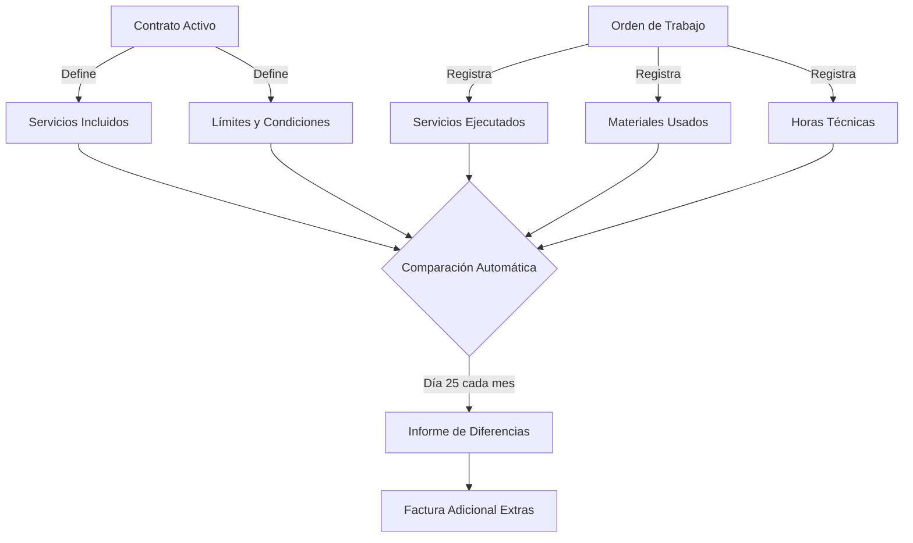
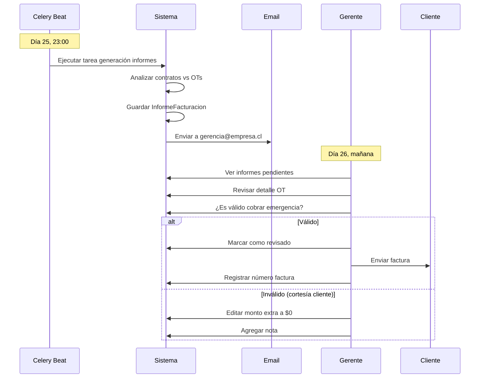

# Flujo de Facturación: Contratos vs Órdenes de Trabajo

## 🎯 Objetivo del Sistema

**Evitar pérdidas económicas** mediante el seguimiento automatizado de trabajos ejecutados vs. trabajos contratados.

---

## 📋 Problema de Negocio Original

### Escenario Real

**Cliente:** Clínica Dental Norte  
**Contrato:** Plan Soporte IT Mensual  
**Valor:** $500.000/mes (factura fija)

**Servicios incluidos en el contrato:**
```
✓ 2 visitas técnicas mensuales
✓ Soporte remoto ilimitado
✓ Mantención preventiva trimestral
✓ Respaldos automáticos
```

### Lo que sucedía SIN el sistema

**Mes de Octubre 2024:**

**Ejecutado realmente:**
1. ✅ Visita técnica #1 (15/Oct) - Incluida en contrato
2. ✅ Visita técnica #2 (22/Oct) - Incluida en contrato
3. ⚠️ **Visita técnica #3** (28/Oct) - **EXTRA** (cliente llamó por emergencia)
4. ⚠️ **Visita técnica #4** (30/Oct) - **EXTRA** (seguimiento emergencia)
5. ⚠️ **Compra de switch de red** ($120.000) - **NO incluido** en contrato
6. ⚠️ **Instalación de switch** (4 horas técnico) - **EXTRA**

**Resultado:**
- Se facturó: $500.000 (contrato mensual)
- Costos reales: $500.000 + $300.000 (2 visitas) + $120.000 (switch) + $80.000 (instalación) = **$1.000.000**
- **PÉRDIDA: $500.000** ❌

**¿Por qué la pérdida?**
- Técnicos hacen el trabajo y lo registran en planillas Excel
- Gerencia no ve consolidado de extras
- Al facturar, solo se cobra el plan mensual
- Los extras se "olvidan"

---

## ✅ Solución: Sistema ERP con Contratos + OT

### Arquitectura de Seguimiento



### Flujo Paso a Paso

#### 1️⃣ Configuración Inicial (Una vez)

**Crear Contrato con límites:**
```python
# Backend: contratos/models.py
contrato = ContratoEmpresaCliente.objects.create(
    empresa_prestadora=tech_support,
    empresa_cliente=clinica_dental,
    nombre="Plan Soporte IT Mensual",
    tipo="servicios",
    fecha_inicio=date(2024, 1, 1),
    fecha_fin=date(2024, 12, 31),
    estado="activo"
)

# Visitas incluidas (límite mensual)
visita_mantencion = Visita.objects.get(descripcion="Mantención Preventiva")
ContratoVisita.objects.create(
    contrato=contrato,
    visita=visita_mantencion,
    frecuencia="mensual",
    cantidad=2  # ⚠️ LÍMITE: 2 visitas/mes incluidas
)

# Servicios incluidos
soporte_remoto = Servicio.objects.get(nombre="Soporte Remoto")
ContratoServicio.objects.create(
    contrato=contrato,
    content_type=ContentType.objects.get_for_model(Servicio),
    object_id=soporte_remoto.id,
    cantidad=1,
    precio_unitario=0  # Ilimitado incluido
)
```

#### 2️⃣ Ejecución de Trabajos (Durante el mes)

**Cada vez que se hace un trabajo:**
```python
# 15/Oct - Visita #1 (Incluida)
ot1 = OrdenDeTrabajo.objects.create(
    empresa=tech_support,
    cliente=clinica_dental,
    contrato_base=contrato,  # 🔗 Vinculada al contrato
    descripcion="Mantención preventiva",
    estado="completada"
)

detalle1 = DetalleTrabajo.objects.create(
    orden=ot1,
    nombre="Revisión equipos",
    tipo_servicio="visita_mantencion",  # 🏷️ Tag para match
    esta_en_contrato=True  # ✅ Dentro del límite
)

# 28/Oct - Visita #3 (EXTRA)
ot3 = OrdenDeTrabajo.objects.create(
    empresa=tech_support,
    cliente=clinica_dental,
    contrato_base=contrato,
    descripcion="Emergencia: servidor caído",
    estado="completada"
)

detalle3 = DetalleTrabajo.objects.create(
    orden=ot3,
    nombre="Reparación servidor",
    tipo_servicio="visita_mantencion",
    esta_en_contrato=False,  # ❌ Excede límite (2/mes)
    precio_extra=150000  # Cobro adicional
)

# Compra de switch
from bodegas.models import Compra
compra_switch = Compra.objects.create(
    proveedor=proveedor_cisco,
    bodega_temporal=bodega_tech,
    observaciones="Switch para Clínica Dental"
)

ItemEnCompra.objects.create(
    compra=compra_switch,
    item=switch_24_puertos,
    cantidad=1,
    precio_unitario=120000
)

# Vincular compra a OT
detalle_compra = DetalleTrabajo.objects.create(
    orden=ot3,
    nombre="Adquisición switch de red",
    content_type=ContentType.objects.get_for_model(Compra),
    trabajo_id=compra_switch.id,
    esta_en_contrato=False,  # ❌ Material no incluido
    precio_extra=120000
)
```

#### 3️⃣ Cierre de Mes (Día 25 - Automático)

**Tarea Celery programada:**
```python
# core/tasks.py
from celery import shared_task
from django.utils import timezone
from datetime import datetime, timedelta
from contratos.models import ContratoEmpresaCliente
from ordentrabajo.models import OrdenDeTrabajo, DetalleTrabajo
from django.db.models import Sum, Count, Q

@shared_task
def generar_informes_facturacion_mensual():
    """
    Se ejecuta cada día 25 del mes a las 23:00
    Genera informes de diferencias entre contratos y OTs
    """
    hoy = timezone.now().date()
    
    # Verificar que sea día 25
    if hoy.day != 25:
        return "No es día de cierre (25)"
    
    # Período: desde día 26 del mes anterior hasta hoy
    inicio_periodo = hoy.replace(day=26) - timedelta(days=30)
    fin_periodo = hoy
    
    # Obtener todos los contratos activos
    contratos = ContratoEmpresaCliente.objects.filter(
        estado='activo',
        fecha_inicio__lte=fin_periodo,
    ).filter(
        Q(fecha_fin__gte=inicio_periodo) | Q(fecha_fin__isnull=True)
    )
    
    informes_generados = []
    
    for contrato in contratos:
        informe = generar_informe_diferencias_contrato(
            contrato,
            inicio_periodo,
            fin_periodo
        )
        informes_generados.append(informe)
        
        # Enviar email a gerencia
        enviar_informe_por_email(informe)
    
    return f"Generados {len(informes_generados)} informes"


def generar_informe_diferencias_contrato(contrato, fecha_inicio, fecha_fin):
    """
    Compara lo ejecutado vs lo contratado en un período
    """
    # 1. OTs vinculadas al contrato en el período
    ots_periodo = OrdenDeTrabajo.objects.filter(
        contrato_base=contrato,
        fecha_creacion__range=[fecha_inicio, fecha_fin],
        estado__in=['completada', 'cerrada', 'facturada']
    )
    
    # 2. Analizar visitas
    visitas_contratadas = ContratoVisita.objects.filter(contrato=contrato)
    visitas_realizadas = DetalleTrabajo.objects.filter(
        orden__in=ots_periodo,
        content_type=ContentType.objects.get_for_model(VisitaSoporte)
    ).count()
    
    # 3. Analizar extras
    detalles_extras = DetalleTrabajo.objects.filter(
        orden__in=ots_periodo,
        esta_en_contrato=False
    )
    
    total_extras = detalles_extras.aggregate(
        total=Sum('precio_extra')
    )['total'] or 0
    
    # 4. Analizar compras
    compras_extras = DetalleTrabajo.objects.filter(
        orden__in=ots_periodo,
        content_type=ContentType.objects.get_for_model(Compra),
        esta_en_contrato=False
    )
    
    total_compras = sum(
        detalle.trabajo.monto_total 
        for detalle in compras_extras 
        if detalle.trabajo
    )
    
    # 5. Generar informe estructurado
    informe = {
        'contrato_id': contrato.id,
        'contrato_nombre': contrato.nombre,
        'cliente': contrato.empresa_cliente.nombre,
        'periodo': {
            'inicio': fecha_inicio,
            'fin': fecha_fin
        },
        'resumen': {
            'valor_contrato_mensual': contrato.valor_mensual,  # Campo faltante
            'visitas_incluidas': sum(cv.cantidad for cv in visitas_contratadas),
            'visitas_realizadas': visitas_realizadas,
            'visitas_extras': max(0, visitas_realizadas - sum(cv.cantidad for cv in visitas_contratadas)),
        },
        'extras': {
            'servicios': total_extras,
            'materiales': total_compras,
            'total': total_extras + total_compras
        },
        'total_a_facturar': total_extras + total_compras,
        'detalles': [
            {
                'ot_id': detalle.orden.id,
                'descripcion': detalle.nombre,
                'tipo': 'servicio' if detalle.precio_extra else 'material',
                'monto': detalle.precio_extra or (detalle.trabajo.monto_total if detalle.trabajo else 0),
                'fecha': detalle.fecha_creacion
            }
            for detalle in detalles_extras
        ] + [
            {
                'ot_id': detalle.orden.id,
                'descripcion': f"Compra: {detalle.trabajo}",
                'tipo': 'material',
                'monto': detalle.trabajo.monto_total,
                'fecha': detalle.fecha_creacion
            }
            for detalle in compras_extras
            if detalle.trabajo
        ]
    }
    
    # 6. Guardar en BD (nuevo modelo)
    InformeFacturacion.objects.create(
        contrato=contrato,
        periodo_inicio=fecha_inicio,
        periodo_fin=fecha_fin,
        valor_contrato=contrato.valor_mensual,
        total_extras=informe['extras']['total'],
        total_a_facturar=informe['total_a_facturar'],
        datos_detallados=informe  # JSONField
    )
    
    return informe


def enviar_informe_por_email(informe):
    """
    Envía el informe a gerencia para revisión y facturación
    """
    from core.tasks import send_email_task
    
    subject = f"Informe Facturación - {informe['cliente']} - {informe['periodo']['fin'].strftime('%B %Y')}"
    
    # Construir tabla HTML
    detalles_html = "<table><tr><th>OT</th><th>Descripción</th><th>Tipo</th><th>Monto</th></tr>"
    for detalle in informe['detalles']:
        detalles_html += f"""
        <tr>
            <td>#{detalle['ot_id']}</td>
            <td>{detalle['descripcion']}</td>
            <td>{detalle['tipo']}</td>
            <td>${detalle['monto']:,.0f}</td>
        </tr>
        """
    detalles_html += "</table>"
    
    html_body = f"""
    <h2>Resumen de Facturación</h2>
    <p><strong>Cliente:</strong> {informe['cliente']}</p>
    <p><strong>Período:</strong> {informe['periodo']['inicio']} al {informe['periodo']['fin']}</p>
    
    <h3>Contrato Base</h3>
    <ul>
        <li>Valor mensual: ${informe['resumen']['valor_contrato_mensual']:,.0f}</li>
        <li>Visitas incluidas: {informe['resumen']['visitas_incluidas']}</li>
        <li>Visitas realizadas: {informe['resumen']['visitas_realizadas']}</li>
        <li>Visitas extras: {informe['resumen']['visitas_extras']}</li>
    </ul>
    
    <h3>Extras a Cobrar</h3>
    <ul>
        <li>Servicios extras: ${informe['extras']['servicios']:,.0f}</li>
        <li>Materiales: ${informe['extras']['materiales']:,.0f}</li>
    </ul>
    
    <h2 style="color: green;">Total a Facturar: ${informe['total_a_facturar']:,.0f}</h2>
    
    <h3>Detalle de Extras</h3>
    {detalles_html}
    """
    
    send_email_task.delay(
        subject,
        ['gerencia@techsupport.cl', 'contabilidad@techsupport.cl'],
        html_body,
        "Informe de Facturación Mensual",
        f"{os.getenv('FRONTEND_URL')}/informes-facturacion/{informe['contrato_id']}",
        "Ver Informe Completo",
        []
    )
```

#### 4️⃣ Modelos Faltantes (A Implementar)

```python
# contratos/models.py

class ContratoEmpresaCliente(ModeloBaseHistorico):
    # ... campos existentes ...
    
    # ⚠️ CAMPOS FALTANTES:
    valor_mensual = DecimalField(
        max_digits=10, 
        decimal_places=2,
        default=0,
        verbose_name="Valor Mensual Base"
    )
    dia_facturacion = PositiveIntegerField(
        default=25,
        verbose_name="Día de Cierre/Facturación"
    )
    incluye_materiales = BooleanField(
        default=False,
        verbose_name="Materiales Incluidos en Precio Base"
    )


# ordentrabajo/models.py

class OrdenDeTrabajo(ModeloBaseHistorico):
    # ... campos existentes ...
    
    # ⚠️ CAMPO FALTANTE:
    contrato_base = ForeignKey(
        'contratos.ContratoEmpresaCliente',
        on_delete=models.SET_NULL,
        null=True,
        blank=True,
        related_name='ordenes_trabajo',
        verbose_name="Contrato Asociado"
    )


class DetalleTrabajo(ModeloBaseHistorico):
    # ... campos existentes ...
    
    # ⚠️ CAMPOS FALTANTES:
    esta_en_contrato = BooleanField(
        default=True,
        verbose_name="Incluido en Contrato Base"
    )
    precio_extra = DecimalField(
        max_digits=10,
        decimal_places=2,
        default=0,
        verbose_name="Precio Adicional (si es extra)"
    )
    tipo_servicio = CharField(
        max_length=50,
        blank=True,
        null=True,
        verbose_name="Tipo de Servicio (para matching con contrato)"
    )


# Nuevo modelo
class InformeFacturacion(ModeloBaseHistorico):
    """
    Guarda los informes generados automáticamente cada día 25
    """
    contrato = ForeignKey(
        'contratos.ContratoEmpresaCliente',
        on_delete=models.CASCADE,
        related_name='informes_facturacion'
    )
    periodo_inicio = DateField(verbose_name="Inicio del Período")
    periodo_fin = DateField(verbose_name="Fin del Período")
    
    # Montos
    valor_contrato = DecimalField(
        max_digits=10,
        decimal_places=2,
        verbose_name="Valor Base Contrato"
    )
    total_extras = DecimalField(
        max_digits=10,
        decimal_places=2,
        verbose_name="Total Servicios/Materiales Extras"
    )
    total_a_facturar = DecimalField(
        max_digits=10,
        decimal_places=2,
        verbose_name="Total a Facturar (Base + Extras)"
    )
    
    # Detalle completo en JSON
    datos_detallados = JSONField(
        default=dict,
        verbose_name="Datos Completos del Informe"
    )
    
    # Control
    revisado = BooleanField(default=False)
    revisado_por = ForeignKey(
        'empresas.UsuarioEmpresa',
        on_delete=models.SET_NULL,
        null=True,
        blank=True
    )
    fecha_revision = DateTimeField(null=True, blank=True)
    
    facturado = BooleanField(default=False)
    numero_factura = CharField(max_length=50, blank=True, null=True)
    fecha_facturacion = DateField(null=True, blank=True)
    
    class Meta:
        verbose_name = "Informe de Facturación"
        verbose_name_plural = "Informes de Facturación"
        unique_together = [['contrato', 'periodo_inicio', 'periodo_fin']]
        ordering = ['-periodo_fin']
    
    def __str__(self):
        return f"Informe {self.contrato.empresa_cliente.nombre} - {self.periodo_fin.strftime('%B %Y')}"
```

#### 5️⃣ Configuración de Celery Beat

```python
# sw_erp/celery.py

from celery.schedules import crontab

app.conf.beat_schedule = {
    # ... otras tareas ...
    
    'generar-informes-facturacion-mensual': {
        'task': 'core.tasks.generar_informes_facturacion_mensual',
        'schedule': crontab(day_of_month='25', hour=23, minute=0),
        # Se ejecuta el día 25 de cada mes a las 23:00
    },
}
```

---

## 🎨 Vista de Gerencia (Frontend)

### Dashboard de Informes

```typescript
// frontend/src/pages/InformesFacturacion.tsx

interface InformeFacturacion {
  id: number;
  contrato: {
    nombre: string;
    cliente: string;
  };
  periodo: {
    inicio: string;
    fin: string;
  };
  valor_contrato: number;
  total_extras: number;
  total_a_facturar: number;
  revisado: boolean;
  facturado: boolean;
  detalles: Array<{
    ot_id: number;
    descripcion: string;
    tipo: 'servicio' | 'material';
    monto: number;
  }>;
}

const InformesFacturacionPage = () => {
  const [informes, setInformes] = useState<InformeFacturacion[]>([]);
  const [filtro, setFiltro] = useState<'pendientes' | 'todos'>('pendientes');
  
  useEffect(() => {
    const cargarInformes = async () => {
      const response = await BaseService.get<InformeFacturacion[]>(
        '/api/informes-facturacion/',
        { revisado: filtro === 'pendientes' ? false : undefined }
      );
      setInformes(response.data);
    };
    cargarInformes();
  }, [filtro]);
  
  const marcarRevisado = async (informeId: number) => {
    await BaseService.patch(`/api/informes-facturacion/${informeId}/`, {
      revisado: true
    });
    // Recargar...
  };
  
  const generarFactura = async (informeId: number) => {
    const numeroFactura = prompt("Ingrese número de factura:");
    await BaseService.patch(`/api/informes-facturacion/${informeId}/`, {
      facturado: true,
      numero_factura: numeroFactura,
      fecha_facturacion: new Date().toISOString()
    });
    // Recargar...
  };
  
  return (
    <div className="p-6">
      <h1 className="text-2xl font-bold mb-4">Informes de Facturación</h1>
      
      <div className="mb-4">
        <button onClick={() => setFiltro('pendientes')}>Pendientes</button>
        <button onClick={() => setFiltro('todos')}>Todos</button>
      </div>
      
      <table className="w-full">
        <thead>
          <tr>
            <th>Cliente</th>
            <th>Período</th>
            <th>Base</th>
            <th>Extras</th>
            <th>Total</th>
            <th>Estado</th>
            <th>Acciones</th>
          </tr>
        </thead>
        <tbody>
          {informes.map(informe => (
            <tr key={informe.id}>
              <td>{informe.contrato.cliente}</td>
              <td>{formatPeriod(informe.periodo)}</td>
              <td>${informe.valor_contrato.toLocaleString()}</td>
              <td className="text-orange-600">
                ${informe.total_extras.toLocaleString()}
              </td>
              <td className="font-bold text-green-600">
                ${informe.total_a_facturar.toLocaleString()}
              </td>
              <td>
                {informe.facturado ? '✅ Facturado' : 
                 informe.revisado ? '⏳ Revisado' : 
                 '🔴 Pendiente'}
              </td>
              <td>
                {!informe.revisado && (
                  <button onClick={() => marcarRevisado(informe.id)}>
                    Revisar
                  </button>
                )}
                {informe.revisado && !informe.facturado && (
                  <button onClick={() => generarFactura(informe.id)}>
                    Facturar
                  </button>
                )}
                <button onClick={() => verDetalle(informe.id)}>
                  Ver Detalle
                </button>
              </td>
            </tr>
          ))}
        </tbody>
      </table>
    </div>
  );
};
```

---

## 📊 Ejemplo Real Completo

### Mes de Octubre 2024

**Contrato configurado:**
```json
{
  "nombre": "Plan Soporte IT Mensual",
  "valor_mensual": 500000,
  "servicios_incluidos": [
    {
      "tipo": "visita_mantencion",
      "cantidad_mensual": 2,
      "descripcion": "Visitas técnicas preventivas"
    },
    {
      "tipo": "soporte_remoto",
      "cantidad_mensual": null,
      "descripcion": "Ilimitado"
    }
  ]
}
```

**OTs ejecutadas (26 Sep - 25 Oct):**
```json
[
  {
    "ot_id": 101,
    "fecha": "2024-10-05",
    "descripcion": "Mantención preventiva",
    "tipo": "visita_mantencion",
    "esta_en_contrato": true,
    "precio_extra": 0
  },
  {
    "ot_id": 102,
    "fecha": "2024-10-15",
    "descripcion": "Mantención preventiva",
    "tipo": "visita_mantencion",
    "esta_en_contrato": true,
    "precio_extra": 0
  },
  {
    "ot_id": 103,
    "fecha": "2024-10-20",
    "descripcion": "Emergencia: servidor caído",
    "tipo": "visita_mantencion",
    "esta_en_contrato": false,  // 3ra visita
    "precio_extra": 150000
  },
  {
    "ot_id": 104,
    "fecha": "2024-10-22",
    "descripcion": "Seguimiento emergencia",
    "tipo": "visita_mantencion",
    "esta_en_contrato": false,  // 4ta visita
    "precio_extra": 150000
  },
  {
    "ot_id": 105,
    "fecha": "2024-10-22",
    "descripcion": "Compra switch Cisco 24 puertos",
    "tipo": "compra",
    "esta_en_contrato": false,
    "precio_extra": 120000
  },
  {
    "ot_id": 106,
    "fecha": "2024-10-23",
    "descripcion": "Instalación y configuración switch",
    "tipo": "servicio_tecnico",
    "esta_en_contrato": false,
    "precio_extra": 80000,
    "horas": 4
  }
]
```

**Informe generado automáticamente (25 Oct 23:00):**
```json
{
  "contrato_id": 42,
  "cliente": "Clínica Dental Norte",
  "periodo": {
    "inicio": "2024-09-26",
    "fin": "2024-10-25"
  },
  "resumen": {
    "valor_contrato_mensual": 500000,
    "visitas_incluidas": 2,
    "visitas_realizadas": 4,
    "visitas_extras": 2
  },
  "extras": {
    "servicios": 380000,  // 150k + 150k + 80k
    "materiales": 120000,
    "total": 500000
  },
  "total_a_facturar": 1000000,  // 500k base + 500k extras
  "detalles": [
    {
      "ot_id": 103,
      "descripcion": "Emergencia: servidor caído",
      "tipo": "servicio",
      "monto": 150000,
      "fecha": "2024-10-20"
    },
    {
      "ot_id": 104,
      "descripcion": "Seguimiento emergencia",
      "tipo": "servicio",
      "monto": 150000,
      "fecha": "2024-10-22"
    },
    {
      "ot_id": 105,
      "descripcion": "Compra switch Cisco 24 puertos",
      "tipo": "material",
      "monto": 120000,
      "fecha": "2024-10-22"
    },
    {
      "ot_id": 106,
      "descripcion": "Instalación y configuración switch",
      "tipo": "servicio",
      "monto": 80000,
      "fecha": "2024-10-23"
    }
  ]
}
```

**Email enviado a gerencia:**
```
Para: gerencia@techsupport.cl, contabilidad@techsupport.cl
Asunto: Informe Facturación - Clínica Dental Norte - Octubre 2024

───────────────────────────────────
RESUMEN DE FACTURACIÓN
───────────────────────────────────

Cliente: Clínica Dental Norte
Período: 26/09/2024 al 25/10/2024

CONTRATO BASE
• Valor mensual: $500.000
• Visitas incluidas: 2
• Visitas realizadas: 4
• Visitas extras: 2

EXTRAS A COBRAR
• Servicios extras: $380.000
• Materiales: $120.000

TOTAL A FACTURAR: $1.000.000
───────────────────────────────────

DETALLE DE EXTRAS:
1. OT #103 - Emergencia servidor - $150.000
2. OT #104 - Seguimiento - $150.000
3. OT #105 - Switch Cisco - $120.000
4. OT #106 - Instalación switch - $80.000

[Ver Informe Completo]
```

---

## 🔄 Flujo de Revisión Manual

Aunque el sistema genera automáticamente, hay supervisión humana:



---

## ✅ Checklist de Exploración

Para entender completamente el sistema, necesitas explorar:

### 1. Contratos (Ya documentado)
- [ ] Entender `ContratoEmpresaCliente`
- [ ] Entender `ContratoServicio` (polimorfismo)
- [ ] Entender `ContratoVisita` (límites)
- [ ] Entender `ContratoLicencia` (windowing)

### 2. Vincular OT ↔ Contratos (A implementar)
- [ ] Agregar campo `contrato_base` en `OrdenDeTrabajo`
- [ ] Agregar campo `esta_en_contrato` en `DetalleTrabajo`
- [ ] Agregar campo `precio_extra` en `DetalleTrabajo`
- [ ] Crear modelo `InformeFacturacion`

### 3. Lógica de Comparación (A implementar)
- [ ] Función `calcular_servicios_incluidos(contrato, periodo)`
- [ ] Función `calcular_servicios_ejecutados(contrato, periodo)`
- [ ] Función `detectar_extras(incluidos, ejecutados)`
- [ ] Función `calcular_precio_extras(extras)`

### 4. Automatización (A implementar)
- [ ] Tarea Celery `generar_informes_facturacion_mensual`
- [ ] Configurar Celery Beat para día 25
- [ ] Template de email para gerencia
- [ ] Endpoint API para revisar informes

### 5. Frontend (A implementar)
- [ ] Página de informes de facturación
- [ ] Vista detalle de informe
- [ ] Acción "Marcar como revisado"
- [ ] Acción "Registrar factura"
- [ ] Dashboard con métricas (extras promedio, clientes con más extras)

---

## 🎯 Próximo Paso Recomendado

**Explora los contratos en profundidad:**

1. Lee el documento `MODULOS_AUTENTICACION_Y_CONTRATOS.md` sección de Contratos
2. Ejecuta consultas en la BD para ver contratos reales
3. Crea un contrato de prueba con límites
4. Crea OTs vinculadas y mide manualmente las diferencias
5. Diseña el algoritmo de comparación

**Comando para empezar:**
```cmd
cd backend
ENV\Scripts\python.exe manage.py shell
```

```python
# En shell
from contratos.models import *
from ordentrabajo.models import *

# Ver contratos activos
contratos = ContratoEmpresaCliente.objects.filter(estado='activo')
for c in contratos:
    print(f"{c.nombre} - {c.empresa_cliente.nombre}")
    
# Ver visitas en contrato
visitas = ContratoVisita.objects.filter(contrato=contratos.first())
for v in visitas:
    print(f"  {v.visita.descripcion}: {v.cantidad}/mes")
```

¿Te quedó más claro el flujo completo? ¿Quieres que profundice en alguna parte específica?
