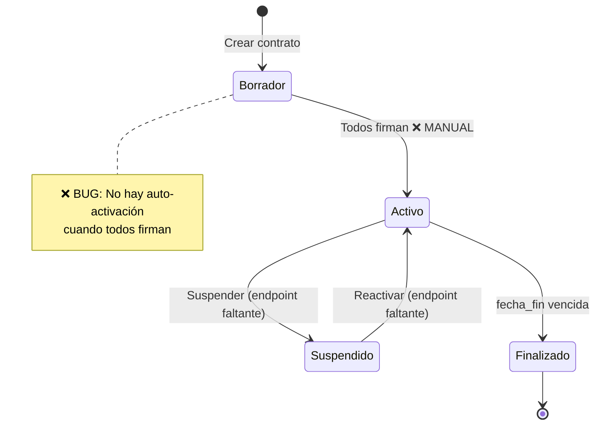
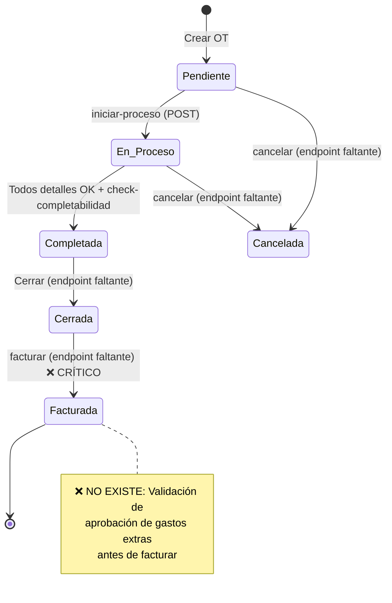

# 🔄 Ciclos Completos: Contrato y Orden de Trabajo

**Propósito**: Este documento proporciona una guía paso a paso para ejecutar los ciclos de vida completos de **Contratos** y **Órdenes de Trabajo**, identificando endpoints, estados, validaciones y puntos de integración críticos para tu meta final (comunicación de gastos extras al cliente).

---

## 📋 Tabla de Contenidos

1. [Ciclo de Contrato](#ciclo-de-contrato)
2. [Ciclo de Orden de Trabajo](#ciclo-de-orden-de-trabajo)
3. [Puntos de Integración Críticos](#puntos-de-integración-críticos)
4. [Cómo Ejecutar Manualmente](#cómo-ejecutar-manualmente)
5. [Gaps Identificados](#gaps-identificados)

---

## 🎯 Ciclo de Contrato

### Estados del Contrato

```python
# contratos/estados_modelo.py
ESTADOS_CONTRATO = [
    ('borrador', 'Borrador'),      # 🟡 Estado inicial
    ('activo', 'Activo'),          # 🟢 Todos los usuarios firmaron
    ('suspendido', 'Suspendido'),  # 🟠 Suspensión temporal
    ('finalizado', 'Finalizado')   # ⚫ Vencido o completado
]
```

### Flujo de Estados



### Endpoints del Ciclo

| Fase | Endpoint | Método | Propósito |
|------|----------|--------|-----------|
| **1. Creación** | `/api/contratos/` | POST | Crear contrato en estado `borrador` |
| **2. Usuarios** | `/api/contratos/{id}/usuarios-vinculados/` | POST | Vincular usuarios que deben firmar |
| **3. Envío Firma** | `/api/contratos/{id}/usuarios-vinculados/{uv_id}/envio-firma/` | POST | Crear `EnvioContratoFirmaUsuario` |
| **4. Firma Pública** | `/api/envio-firma/{uuid}/firmar/` | PATCH | Usuario firma (sin auth) |
| **5. Check Acuerdos** | `/api/acuerdos-por-envio/{uuid}/` | GET | Obtener acuerdos de confidencialidad |
| **6. Reenvío** | `/api/contratos/{id}/usuarios-vinculados/{uv_id}/envio-firma/{ef_id}/reenviar/` | POST | Reenviar correo de firma |

### ❌ Endpoints Faltantes

```python
# ESTAS ACCIONES NO EXISTEN EN EL SISTEMA ACTUAL
@action(detail=True, methods=['post'], url_path='activar')
def activar(self, request, pk=None):
    """Cambiar estado de borrador → activo manualmente"""
    pass  # ❌ NO IMPLEMENTADO

@action(detail=True, methods=['post'], url_path='suspender')
def suspender(self, request, pk=None):
    """Cambiar estado activo → suspendido"""
    pass  # ❌ NO IMPLEMENTADO

@action(detail=True, methods=['post'], url_path='reactivar')
def reactivar(self, request, pk=None):
    """Cambiar estado suspendido → activo"""
    pass  # ❌ NO IMPLEMENTADO

@action(detail=True, methods=['post'], url_path='finalizar')
def finalizar(self, request, pk=None):
    """Cambiar estado activo → finalizado manualmente"""
    pass  # ❌ NO IMPLEMENTADO
```

### Ciclo Paso a Paso

#### 1️⃣ Crear Contrato (Estado: `borrador`)

```json
POST /api/contratos/
{
  "empresa_prestadora": 1,
  "empresa_cliente": 2,
  "fecha_inicio": "2025-01-01",
  "fecha_fin": "2025-12-31",
  "nombre": "Contrato Soporte TI 2025",
  "tipo": "servicios",
  "estado": "borrador",
  "observaciones": "Contrato anual de soporte"
}
```

**Respuesta esperada**: 
```json
{
  "id": 42,
  "estado": "borrador",
  "uuid": "a1b2c3d4-...",
  ...
}
```

#### 2️⃣ Vincular Usuarios

```json
POST /api/contratos/42/usuarios-vinculados/
{
  "usuario": 5,  # ID de UsuarioEmpresa
  "tipo_usuario": "gerencia"
}
```

**Respuesta**:
```json
{
  "id": 10,
  "usuario": 5,
  "contrato": 42,
  "tipo_usuario": "gerencia"
}
```

#### 3️⃣ Enviar Contrato a Firma

```json
POST /api/contratos/42/usuarios-vinculados/10/envio-firma/
{
  "usuario": 10
}
```

**Qué hace internamente** (`contratos/views.py:549-605`):
1. Crea `EnvioContratoFirmaUsuario` con UUID único
2. Marca `enviado=True`, `fecha_envio=now()`
3. Dispara tarea Celery `send_email_task.delay()`
4. Email contiene link: `https://app.gestionsnabb-it.cl/firmar-contrato/{uuid}`

**Respuesta**:
```json
{
  "id": 7,
  "uuid": "e4f5g6h7-...",
  "enviado": true,
  "fecha_envio": "2025-11-07T10:30:00Z",
  "firmado": false,
  "usuario": 10
}
```

#### 4️⃣ Usuario Firma el Contrato (Público)

```json
PATCH /api/envio-firma/e4f5g6h7-.../firmar/
{
  "firma": "data:image/png;base64,iVBORw0KG...",
  "fecha_firma": "2025-11-07T14:20:00Z",
  "firmado": true
}
```

**Respuesta**:
```json
{
  "uuid": "e4f5g6h7-...",
  "firma": "data:image/png;base64,...",
  "fecha_firma": "2025-11-07T14:20:00Z",
  "firmado": true
}
```

#### 5️⃣ ❌ Auto-Activación (NO EXISTE)

**Esperado**: Signal que detecte cuando **TODOS** los `EnvioContratoFirmaUsuario` tienen `firmado=True` y cambie `contrato.estado = 'activo'`.

**Realidad**: Hay que cambiar manualmente el estado en el admin o base de datos.

**Código propuesto** (ver `MODULO_CONTRATOS_ENVIO_FIRMA.md`):
```python
# contratos/signals.py
@receiver(post_save, sender=EnvioContratoFirmaUsuario)
def auto_activar_contrato(sender, instance, **kwargs):
    if not instance.firmado:
        return
    
    contrato = instance.usuario.contrato
    envios = contrato.vinculos_contrato.select_related('enviocontratofirmausuario').all()
    
    total_envios = envios.count()
    firmados = sum(1 for v in envios if hasattr(v, 'enviocontratofirmausuario') 
                   and v.enviocontratofirmausuario.firmado)
    
    if total_envios > 0 and firmados == total_envios:
        contrato.estado = 'activo'
        contrato.save(update_fields=['estado'])
```

#### 6️⃣ Finalización Automática

**Lógica existente** (`contratos/models.py:48-54`):
```python
def actualizar_estado(self):
    if self.fecha_fin and self.fecha_fin < date.today():
        self.estado = 'finalizado'
```

**Tarea Celery** (`contratos/tareas_2do_plano.py:7-12`):
```python
@shared_task
def finalizar_contratos_vencidos():
    contratos_vencidos = ContratoEmpresaCliente.objects.filter(
        fecha_fin__lt=date.today(), 
        estado='activo'
    )
    for contrato in contratos_vencidos:
        contrato.estado = 'finalizado'
        contrato.save()
```

---

## 🛠️ Ciclo de Orden de Trabajo

### Estados de la OT

```python
# ordentrabajo/estados_modelo.py
ESTADOS_ORDEN = [
    ('pendiente', 'Pendiente'),      # 🟡 Estado inicial
    ('en_proceso', 'En Proceso'),    # 🔵 Trabajo iniciado
    ('completada', 'Completada'),    # 🟢 Todos los detalles terminados
    ('cerrada', 'Cerrada'),          # ⚫ Cerrada administrativamente
    ('facturada', 'Facturada'),      # 💰 Facturada al cliente
    ('cancelada', 'Cancelada')       # ❌ Cancelada
]
```

### Flujo de Estados



### Endpoints del Ciclo

| Fase | Endpoint | Método | Propósito |
|------|----------|--------|-----------|
| **1. Creación** | `/api/ordenes-trabajo/` | POST | Crear OT en estado `pendiente` |
| **2. Detalles** | `/api/ordenes-trabajo/{ot_id}/detalles-trabajo/` | POST | Agregar detalle (cotización/visita/compra) |
| **3. Usuarios** | `/api/ordenes-trabajo/{ot_id}/usuarios-vinculados/` | POST | Asignar técnicos/responsables |
| **4. Iniciar** | `/api/ordenes-trabajo/{ot_id}/detalles-trabajo/{det_id}/iniciar-proceso/` | POST | Cambiar estado detalle → `en_proceso` |
| **5. Gastos Extras** | `/api/ordenes-trabajo/{ot_id}/detalles-gastos/` | POST | Registrar `DetalleGastoRendicionOT` |
| **6. Completar** | `/api/ordenes-trabajo/{ot_id}/detalles-trabajo/{det_id}/actualizar-estado/` | PATCH | Cambiar estado detalle → `completado` |
| **7. Check** | `/api/ordenes-trabajo/{ot_id}/check-completabilidad/` | GET | Verificar si OT puede completarse |
| **8. Rendición** | `/api/rendiciones/` | POST | Crear rendición con gastos OT |

### ❌ Endpoints Faltantes

```python
@action(detail=True, methods=['post'], url_path='completar')
def completar(self, request, pk=None):
    """Cambiar estado en_proceso → completada"""
    pass  # ❌ NO IMPLEMENTADO (se hace manualmente)

@action(detail=True, methods=['post'], url_path='cerrar')
def cerrar(self, request, pk=None):
    """Cambiar estado completada → cerrada"""
    pass  # ❌ NO IMPLEMENTADO

@action(detail=True, methods=['post'], url_path='facturar')
def facturar(self, request, pk=None):
    """
    Cambiar estado cerrada → facturada
    ❌ CRÍTICO: Debe validar aprobación de gastos extras
    """
    pass  # ❌ NO IMPLEMENTADO

@action(detail=True, methods=['post'], url_path='cancelar')
def cancelar(self, request, pk=None):
    """Cambiar estado a cancelada"""
    pass  # ❌ NO IMPLEMENTADO

@action(detail=True, methods=['post'], url_path='solicitar-aprobacion-gastos')
def solicitar_aprobacion_gastos(self, request, pk=None):
    """
    1. Crear AprobacionGastosOT con UUID
    2. Generar PDF con gastos extras
    3. Enviar correo al cliente con link público
    """
    pass  # ❌ NO IMPLEMENTADO (TU META FINAL)
```

### Ciclo Paso a Paso

#### 1️⃣ Crear Orden de Trabajo

```json
POST /api/ordenes-trabajo/
{
  "empresa": 1,
  "cliente": 2,
  "fecha_inicio_ot": "2025-11-10",
  "descripcion": "Instalación servidor backup",
  "prioridad": "1",
  "estado": "pendiente",
  "responsable_empresa": 3,
  "solicitante_empresa": 8
}
```

**Respuesta**:
```json
{
  "id": 150,
  "estado": "pendiente",
  "empresa": 1,
  "cliente": 2,
  ...
}
```

#### 2️⃣ Agregar Detalle de Trabajo

```json
POST /api/ordenes-trabajo/150/detalles-trabajo/
{
  "nombre": "Configuración servidor",
  "descripcion": "Instalar Ubuntu Server + Docker",
  "estado": "pendiente",
  "tecnico_asignado": 5,
  "content_type": 15,  # ContentType de 'cotizaciones.Cotizacion'
  "trabajo_id": 42     # ID de la cotización aprobada
}
```

#### 3️⃣ Iniciar Detalle de Trabajo

```json
POST /api/ordenes-trabajo/150/detalles-trabajo/12/iniciar-proceso/
```

**Lógica interna** (`ordentrabajo/views.py:521-610`):
1. Cambia `detalle.estado = 'en_proceso'`
2. Actualiza `orden.estado = 'en_proceso'`
3. Crea entrada en `HistorialCambiosOrden`

#### 4️⃣ Registrar Gastos Extras

```json
POST /api/ordenes-trabajo/150/detalles-gastos/
{
  "categoria": 3,  # CategoriaGastoRendicion: "Transporte"
  "detalle": "Taxi ida y vuelta datacenter",
  "cantidad": 2,
  "monto_unitario": 15000,
  "fecha_gasto": "2025-11-12"
}
```

**Qué se guarda**:
```python
DetalleGastoRendicionOT(
    orden=150,
    categoria=3,
    detalle="Taxi ida y vuelta datacenter",
    cantidad=2,
    monto_unitario=15000,
    monto_total=30000,  # Auto-calculado en save()
    fecha_gasto="2025-11-12"
)
```

#### 5️⃣ Completar Detalle de Trabajo

```json
PATCH /api/ordenes-trabajo/150/detalles-trabajo/12/actualizar-estado/
{
  "estado": "completado"
}
```

#### 6️⃣ Verificar Completabilidad de OT

```json
GET /api/ordenes-trabajo/150/check-completabilidad/
```

**Respuesta si TODO está OK**:
```json
{
  "se_puede_completar": true,
  "razones": []
}
```

**Respuesta si HAY PROBLEMAS**:
```json
{
  "se_puede_completar": false,
  "razones": [
    "Detalle 12: estado 'En Proceso' no permite completar",
    "Detalle 13: insumo en estado 'Borrador'",
    "Detalle 14: visita soporte en estado 'Pendiente'"
  ]
}
```

**Validaciones** (`ordentrabajo/views.py:399-441`):
- ✅ Detalle en estado `medianamente_completado`, `completado` o `no_realizado`
- ✅ Insumo (si existe) en estado `T`, `R`, `PR` o `E`
- ✅ Visita (si existe) en estado `completada` o `cerrada`

#### 7️⃣ ❌ Completar OT (Manual)

**No hay endpoint**. Debes cambiar manualmente:
```python
orden = OrdenDeTrabajo.objects.get(id=150)
orden.estado = 'completada'
orden.save()
```

#### 8️⃣ ❌ Solicitar Aprobación de Gastos (NO EXISTE)

**Este es el paso CRÍTICO para tu meta final**. Ver propuesta completa en `ANALISIS_CONTRATOS_OT_CICLO_NEGOCIO.md`.

**Flujo propuesto**:
```json
POST /api/ordenes-trabajo/150/solicitar-aprobacion-gastos/
{
  "mensaje_cliente": "Hola, se generaron gastos adicionales durante la ejecución..."
}
```

**Qué debería hacer**:
1. Crear `AprobacionGastosOT` con UUID único
2. Agregar todos los `DetalleGastoRendicionOT` de la OT
3. Generar PDF con detalle de gastos
4. Enviar correo al cliente con link: `https://app.../aprobar-gastos-ot/{uuid}`

#### 9️⃣ ❌ Cliente Aprueba Gastos (NO EXISTE)

**Página pública** (a implementar):
```
/aprobar-gastos-ot/{uuid}
```

**PATCH endpoint** (a implementar):
```json
PATCH /api/aprobacion-gastos-ot/{uuid}/aprobar/
{
  "aprobado": true,
  "comentario_cliente": "Aprobado, proceder con facturación"
}
```

#### 🔟 ❌ Facturar OT (NO EXISTE)

```json
POST /api/ordenes-trabajo/150/facturar/
```

**Validaciones necesarias**:
```python
@action(detail=True, methods=['post'], url_path='facturar')
def facturar(self, request, pk=None):
    orden = self.get_object()
    
    # ✅ 1. Estado debe ser 'cerrada'
    if orden.estado != 'cerrada':
        return Response({"error": "Solo se pueden facturar OT cerradas"}, 
                        status=400)
    
    # ✅ 2. Si hay gastos extras, deben estar aprobados
    gastos = DetalleGastoRendicionOT.objects.filter(orden=orden)
    if gastos.exists():
        aprobacion = AprobacionGastosOT.objects.filter(
            orden=orden, 
            estado='aprobada'
        ).first()
        
        if not aprobacion:
            return Response({
                "error": "Debe solicitar aprobación de gastos extras antes de facturar"
            }, status=400)
    
    # ✅ 3. Cambiar estado
    orden.estado = 'facturada'
    orden.save()
    
    return Response({"detail": "OT facturada correctamente"})
```

---

## 🔗 Puntos de Integración Críticos

### 1. Contrato ↔ Orden de Trabajo

**Situación actual**: ❌ NO HAY FK DIRECTA

```python
# ordentrabajo/models.py
class OrdenDeTrabajo(ModeloBaseHistorico):
    empresa = models.ForeignKey('empresas.Empresa', ...)
    cliente = models.ForeignKey('empresas.Empresa', ...)
    # ❌ FALTA: contrato = models.ForeignKey('contratos.ContratoEmpresaCliente', ...)
```

**Relación actual**: Indirecta mediante par `(empresa, cliente)`

**Impacto**:
- ❌ No se puede validar que OT esté cubierta por contrato activo
- ❌ No se puede descontar servicios consumidos del contrato
- ❌ Dificulta facturación agrupada por contrato

**Solución propuesta**:
```python
class OrdenDeTrabajo(ModeloBaseHistorico):
    # ... campos existentes ...
    
    contrato = models.ForeignKey(
        'contratos.ContratoEmpresaCliente',
        on_delete=models.SET_NULL,
        null=True,
        blank=True,
        related_name='ordenes_trabajo',
        help_text="Contrato bajo el cual se ejecuta esta OT"
    )
    
    def clean(self):
        super().clean()
        if self.contrato:
            # Validar que contrato esté activo
            if self.contrato.estado != 'activo':
                raise ValidationError(
                    f"El contrato debe estar activo (actual: {self.contrato.estado})"
                )
            
            # Validar que empresas coincidan
            if self.empresa != self.contrato.empresa_prestadora:
                raise ValidationError("Empresa no coincide con contrato")
            if self.cliente != self.contrato.empresa_cliente:
                raise ValidationError("Cliente no coincide con contrato")
```

### 2. Orden de Trabajo → Gastos Extras

**Situación actual**: ✅ EXISTE `DetalleGastoRendicionOT`

```python
# ordentrabajo/models.py
class DetalleGastoRendicionOT(ModeloBaseHistorico):
    orden = models.ForeignKey(OrdenDeTrabajo, ...)
    categoria = models.ForeignKey(CategoriaGastoRendicion, ...)
    detalle = models.CharField(max_length=255, ...)
    cantidad = models.PositiveIntegerField(...)
    monto_unitario = models.PositiveIntegerField(...)
    monto_total = models.PositiveIntegerField(...)  # Auto-calculado
    fecha_gasto = models.DateField()
```

**Problema**: ❌ NO HAY FLUJO DE APROBACIÓN DEL CLIENTE

### 3. Gastos Extras → Rendición Interna

**Situación actual**: ✅ FUNCIONA (pero solo internamente)

```python
# rendiciones/models.py
class Rendicion(ModeloBaseHistorico):
    @property
    def total_rendicion(self):
        total = 0
        for item in self.items.all():
            if item.content_type.app_label == 'ordentrabajo' and \
               item.content_type.model == 'detallegastorendicionot':
                gasto = item.detalle
                total += gasto.monto_total
        return total
```

**Problema**: ❌ Genera PDF interno, NO se comunica al cliente

### 4. ❌ Gastos Extras → Aprobación Cliente (NO EXISTE)

**Este es el GAP CRÍTICO para tu meta final**. Ver implementación completa en `ANALISIS_CONTRATOS_OT_CICLO_NEGOCIO.md`.

**Modelo propuesto**:
```python
class AprobacionGastosOT(ModeloBase):
    uuid = models.UUIDField(unique=True, default=uuid.uuid4)
    orden = models.ForeignKey(OrdenDeTrabajo, on_delete=models.CASCADE)
    estado = models.CharField(
        max_length=20,
        choices=[
            ('pendiente', 'Pendiente'),
            ('aprobada', 'Aprobada'),
            ('rechazada', 'Rechazada')
        ],
        default='pendiente'
    )
    monto_total = models.PositiveIntegerField()  # Suma de DetalleGastoRendicionOT
    mensaje_empresa = models.TextField()
    comentario_cliente = models.TextField(blank=True, null=True)
    fecha_solicitud = models.DateTimeField(auto_now_add=True)
    fecha_respuesta = models.DateTimeField(blank=True, null=True)
    enviado = models.BooleanField(default=False)
    fecha_envio = models.DateTimeField(blank=True, null=True)
```

---

## 🧪 Cómo Ejecutar Manualmente

### Preparación del Entorno

```cmd
REM 1. Backend en ejecución
backend\ENV\Scripts\python.exe manage.py runserver

REM 2. Celery worker (para emails)
backend\ENV\Scripts\python.exe -m celery -A sw_erp worker --loglevel=info

REM 3. Frontend en ejecución
cd frontend
npm run dev
```

### Variables de Entorno Requeridas

```env
# backend/.env
FRONTEND_URL=http://localhost:5173
CORREO_APPWEB=notificaciones@tuempresa.cl
EMAIL_HOST=smtp.gmail.com
EMAIL_PORT=587
EMAIL_HOST_USER=tu-email@gmail.com
EMAIL_HOST_PASSWORD=tu-app-password
```

### Herramientas de Testing

**Opción 1: Frontend UI** (recomendado para ciclo completo)
- Login: `http://localhost:5173/login`
- Panel Contratos: `http://localhost:5173/contratos`
- Panel OT: `http://localhost:5173/ordenes-trabajo`

**Opción 2: API directa con Thunder Client / Postman**
```http
POST http://localhost:8000/api/contratos/
Authorization: Bearer {tu_access_token}
Content-Type: application/json

{
  "empresa_prestadora": 1,
  "empresa_cliente": 2,
  ...
}
```

**Opción 3: Notebook de pruebas** (ya existe en backend)
```cmd
cd backend
ENV\Scripts\python.exe -m jupyter notebook testing_apis.ipynb
```

### Checklist: Ciclo Contrato Completo

- [ ] 1. Crear empresa prestadora y cliente en `/empresas/`
- [ ] 2. Crear usuarios en ambas empresas
- [ ] 3. Crear contrato en estado `borrador`
- [ ] 4. Agregar servicios/licencias/visitas al contrato
- [ ] 5. Vincular usuarios que deben firmar
- [ ] 6. Enviar contrato a firma (verificar email recibido)
- [ ] 7. Abrir link público `/firmar-contrato/{uuid}`
- [ ] 8. Firmar y confirmar
- [ ] 9. **MANUAL**: Cambiar estado a `activo` en admin
- [ ] 10. Verificar que se vea en lista de contratos activos

### Checklist: Ciclo OT Completo

- [ ] 1. Crear OT con contrato activo (o sin contrato)
- [ ] 2. Agregar detalles de trabajo (cotización/visita/compra)
- [ ] 3. Asignar técnicos/responsables
- [ ] 4. Iniciar detalle de trabajo (estado → `en_proceso`)
- [ ] 5. Registrar gastos extras en `DetalleGastoRendicionOT`
- [ ] 6. Completar detalle de trabajo
- [ ] 7. Verificar `check-completabilidad` (debe retornar `true`)
- [ ] 8. **MANUAL**: Cambiar OT a estado `completada`
- [ ] 9. **FALTA**: Solicitar aprobación de gastos al cliente
- [ ] 10. **FALTA**: Cliente aprueba/rechaza gastos
- [ ] 11. **FALTA**: Facturar OT (con validación de aprobación)

---

## 🚨 Gaps Identificados

### Prioridad 🔴 CRÍTICA (Meta Final)

1. **Aprobación de Gastos Extras**
   - **Problema**: Cliente no tiene forma de aprobar gastos antes de facturar
   - **Impacto**: No se puede cumplir meta final del proyecto
   - **Solución**: Ver roadmap en `ANALISIS_CONTRATOS_OT_CICLO_NEGOCIO.md`
   - **Esfuerzo**: 10-15 días

### Prioridad 🟡 ALTA (Bloquea workflows)

2. **Auto-Activación de Contratos**
   - **Problema**: Contratos se quedan en `borrador` después de firmar
   - **Impacto**: Flujo de negocio incompleto
   - **Solución**: Signal `post_save` en `EnvioContratoFirmaUsuario`
   - **Esfuerzo**: 1 día

3. **FK Contrato → OT**
   - **Problema**: No se puede rastrear qué OT pertenece a qué contrato
   - **Impacto**: Dificulta facturación y auditoría
   - **Solución**: Agregar campo `contrato` en `OrdenDeTrabajo`
   - **Esfuerzo**: 2-3 días (migración + validaciones)

### Prioridad 🟢 MEDIA (Mejoras operativas)

4. **Endpoints de Cambio de Estado**
   - **Problema**: Estados se cambian manualmente en admin
   - **Impacto**: Operación manual propensa a errores
   - **Solución**: Crear endpoints `activar`, `suspender`, `completar`, `facturar`
   - **Esfuerzo**: 3-4 días

5. **Validación de Duplicados en Envío**
   - **Problema**: Modal permite crear múltiples envíos del mismo usuario
   - **Impacto**: Emails duplicados, confusión
   - **Solución**: Ver `MODULO_CONTRATOS_ENVIO_FIRMA.md` Bug #1
   - **Esfuerzo**: 0.5 días

---

## 📚 Referencias Cruzadas

- [MODULO_CONTRATOS_ENVIO_FIRMA.md](./MODULO_CONTRATOS_ENVIO_FIRMA.md): Bugs de firma de contratos
- [ANALISIS_CONTRATOS_OT_CICLO_NEGOCIO.md](./ANALISIS_CONTRATOS_OT_CICLO_NEGOCIO.md): Roadmap aprobación gastos
- [HALLAZGOS_Y_MEJORAS.md](../HALLAZGOS_Y_MEJORAS.md): Tracking completo de bugs y notas
- [Arquitectura del Sistema](../arquitectura/sistema.md): Visión general del monorepo

---

**Última actualización**: 2025-11-07  
**Autor**: Exploración con GitHub Copilot  
**Estado**: ✅ Completo - Listo para ejecutar ciclos manualmente
